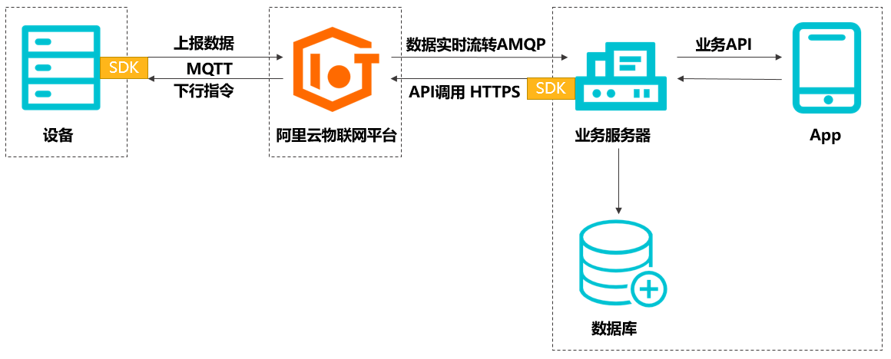
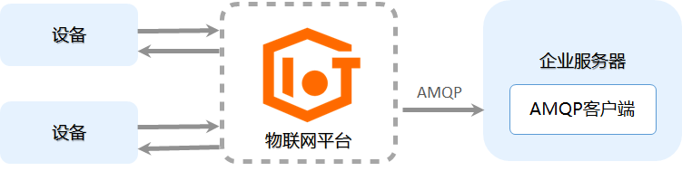
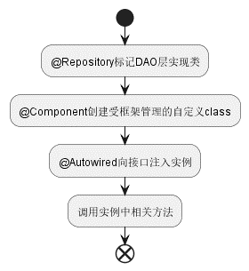

<!-- pandoc --citeproc --csl=china-national-standard-gb-t-7714-2015-numeric.csl --bibliography=ref.bib -M reference-section-title="参考文献" --reference-doc=ref.docx input.md -o main.docx --toc-->

# 第一章 绪论

## 1.1 选题背景及意义

环境数据采集在更好地了解环境状况、监测环境变化、支持研究、促进环境治理、服务公众等方面具有重要的意义。然而，当前环境数据采集存在以下痛点：数据来源不够全面，数据质量难以保证，数据管理和共享困难，数据处理和分析难度大等等，这些问题导致了环境数据采集的效率和质量不尽如人意，限制了其在环境保护和研究方面的应用和发展。

为解决这些痛点，需要采取一系列的措施。例如降低成本，加大监测系统的建设力度，提高数据质量保障；选择统一精简的数据传输协议，方便各平台间的数据流转或迁移；开发简洁可视化的数据展示界面，降低数据分析难度。通过这些措施的实施，可以更好地发挥环境数据采集的作用，为环境保护和研究提供更好的支持和保障。

嵌入式系统是以具体应用为导向的，以计算机技术为核心的根据具体应用对软件和硬件系统定做的微型计算机系统[@HeBinSTCDanPianJiYuanLiJiYingYong2015]。英特尔8051系列单片机具有高集成度、低功耗、可编程等特点，生产成本较低，价格相对于其他微控制器较为便宜，因此广泛应用于嵌入式系统，在低成本系统中大量使用。开发以单片机为控制核心的数据采集系统，不仅能降低成本，也便于设计开发。

随着大数据、物联网等新兴技术的普及，无线通信技术发展越来越块，Wi-Fi覆盖面积越来越大，监测系统也正趋向于对数据的无线传输[@kuoDesignWirelessSensor2018]。环境数据采集的特点是采集点较多，范围较远；若使用传统有线方式传输数据，会大大增加成本。利用ZigBee无线传感器网络进行环境数据采集与传输，优点是功耗低、应用广泛，但其构建的网络是封闭式网络，无法与Internet直接集成，所以传输距离受到限制[@AiHongJiYuZigBeeWuXianChuanShuDeGongNuanWenDuJianCeXiTongYanJiu2018]。利用无线模块nRF905以无线载波的形式将数据传输至上位机，相较于ZigBee虽然在传输距离上得到优化，但系统开放性大，易受干扰[@yangDesignImplementationWireless2015]。利用GPRS无线传输方案，虽然传输距离较远，但目前该网络没有固定IP[@XiaoZhenFengJiYuMSP430F169DeYuanChengZhiNengGuZhangJianCeQi2013]，持续租用公网使得成本上涨。基于以上所述，本设计中利用ESP8266 Wi-Fi通信模块，连接区域内Wi-Fi，与云端服务器实现数据远程通信，降低了成本，解决了发送端IP地址不固定的问题。

MQTT是基于TCP/IP协议构建的异步通信消息协议，是一种轻量级的发布、订阅信息传输协议。可以在不可靠的网络环境中进行扩展，适用于设备硬件存储空间或网络带宽有限的场景。使用MQTT协议，消息发送者与接收者不受时间和空间的限制。物联网平台支持设备使用MQTT协议接入[@MQTTXieYiGuiFan]。由于MQTT协议精简、易于实现，因此在节约带宽和控制功耗方面表现出很好的性能[@GaiRongLiJiYuMQTTDeQiYeXiaoXiTuiSongXiTong2015; @ZhengFengJiYuMQTTDeYunTuiSongPingTaiDeYanJiuJiYingYong2016; @gomesIntegratingMQTTISO2015]。

## 1.2 国内外研究现状

环境信息是影响工业生产与个人生活的关键因素，对环境信息的收集可帮助了解环境的变化，及时采取措施处理异常。在实践中，环境信息收集一般面向特定领域，如农业信息，工业信息等，根据实际需要有所不同，其关键技术主要包括信息感知技术，信息传输技术，信息处理技术等[10]

信息感知是通过感测技术获得信息，例如农业物联网中的感知环节就是部署大量传感器，将各类物理、化学信号转化为电信号，然后通过计算机进行处理[11]。目前，温度传感器使用较多的是数字温度传感器DS18B20，张仲明[12]等将其与单片机结合，构建出基于DS18B20的温度测量系统；朱顺兰[13]等设计的光照强度传感器，以光敏电阻为元件，基于光敏二极管的性能设计电路，提高了光敏传感器的精度。

由于环境复杂多变，信息传输的稳定性至关重要。Wi-Fi也被称为WLAN，Wi-Fi通信具有带宽较宽、传输快、兼容强、抗干扰能力强等优势，在Wi-Fi覆盖区可实现远距离传输。作为一种无线网络技术，Wi-Fi允许计算机和其他设备在没有电线和电缆的情况下相互链接到局域网和英特网[14]。随着Wi-Fi技术和Wi-Fi网络的大面积覆盖，带来了建立物联网系统运输层的新方法，Wang[15]等将传感器网络应用与深海环境监测平台中，使得Wi-Fi无线技术在SOPC的高速可编程上有了新的突破；梁志勋[16]等基于MQTT协议，采用嵌入式集成模块ESP 8266作为主控，结合环境参数感知器等设备，使用Wi-Fi通信实现了对农业大棚内环境的监测。

服务器是相应客户端请求的应用程序或计算机，可为客户端提供计算服务。传统上，开发人员必须构建自己的服务器，大量的底层开发工作使得开发过程成本高、时间长、工作量大。近年来，各种云平台的出现使得物联网系统的数据管理变得非常容易，可以根据云平台提供的服务设计应用程序，形成物联网的应用层。郭美荣[17]等对云平台在农业上的应用进行了初步探究，重点分析了云平台的理论和技术支撑，探讨了云平台的搭建方法和主要框架；姚丹[18]等在IBM Bluemix IoT平台服务的基础上，研究MQTT协议的结构和消息格式，实现了设备和移动端的数据传输。目前，市场主流云平台有AWS（亚马逊）、Azure（微软）、阿里云、腾讯云和OneNet（中国移动），平台功能丰富但成本和便捷程度差别较大。

## 1.3 主要研究内容及预期目标

本设计旨在选择合适的传单其，用于监测收集环境信息，通过无线网络实现数据实时上传，并利用云平台开发简洁明了的用户界面实现数据实时查看。为降低开发成本和难度，本设计采用IAP15W4K32S4作为微控制器，ESP8266模块作为收发器，配置阿里云平台搭建数据传输网络，设计Web界面以实现数据实时查看，以实现低成本的远程环境数据采集方案。本设计的主要内容如下：

1. 设计基于单片机的远程数据采集系统的总体方案。该系统分为三层设计：由单片机为控制核心的信息感知层，由阿里云平台担任的数据流转层以及以web服务器为核心的展示层，其结构如图1-1所示：` 图1-1 系统结构 来自开题报告 `

2. 选取适当的传感器，以IAP15W4K58S4单片机为核心设计硬件电路，通过外部GPIO接口与传感器相互连接，将传感器采集到的数据存于单片机内存中，并在OLED显示屏上展示。

3. 设计适当的硬件电路，连接单片机与ESP8266模块；分析数据格式与传输协议，以MQTT协议规范将数据打包并传送至ESP8266相应GPIO端口，实现信息感知层与数据流转层（阿里云IoT平台）之间的信息传输。

4. 在Keil[19]中配置IAP15W4K32S4的开发环境于硬件库，简化单片机C语言程序开发[20]，调用相应的库函数实现对单片机各端口的控制以及与其他硬件模块之间的信息交互。完成程序设计并烧录至单片机。

5. 利用阿里云IoT平台提供的数据服务，注册设备，配置服务端订阅，利用AMQP服务，实现数据流转层与展示层之间的数据传输。在Web服务器上设计实现一个简洁的用户界面，实现数据的可视化显示，帮助用户远程监控环境数据。

# 第二章 硬件设计

在本设计中，我们使用了IAP15W4K58S4单片机作为信息感知层的核心控制器进行开发，利用OLED显示屏对采集到的数据在现场展示，利用ESP8266芯片实现信息感知层与物联网平台间的通信，利用Keil C51开发环境进行编程以及STC的ISP下载软件对单片机进行烧录。在本节中，将对上述硬件的开发进行介绍。

## 2.1 IAP15W4K58S4单片机

IAP15W4K58S4单片机隶属于STC研发的STC15W4K32S4系列单片机，为STC生产的单时钟/机器周期(1T)的单片机，是宽电压/高可靠/低功耗/超强抗干扰的新一代8051单片机。内部集成高精度R/C时钟(±0.3%)，±1%温飘(-40℃~+85℃)，常温下温飘±0.6%(-20℃~+65℃)。8路10位PWM，8路高速10位A/D转换(30万次/秒)，内置4K字节大容量SRAM，4组独立的高速异步串行通信端口(UART1/UART2/UART3/UART4)，1组高速同步串行通信端口SPI，针对多串口通信/电机控制/强干扰场合。其成本低、性能高、抗干扰性好，是本系统中微控制器的最佳选择。

在本系统设计的信息感知层中，单片机通过UART高速异步通信端口与外围硬件模块进行通信，以实现下载烧录软件，传输数据的功能；使用GPIO引脚进行通信，实现与传感器之间的通信以及与OLED显示屏进行通信用于数据的展示；同时，使用硬件看门狗来保证硬件在运行故障时能够自动重启，以便连续进行工作。下面将对上述技术的原理进行介绍。

### 2.1.1 UART串口通信

UART（Universal Asynchronous Receiver/Transmitter）即通用异步收发传输器，工作于数据链路层。包含了RS－232、RS－422、RS－485串口通信和红外(IrDA) 等等。UART协议作为一种低速通信协议，是一种简单易用、速率可调、半双工、传输距离较短、可靠性较高的通信方式，适用于许多嵌入式系统和计算机之间的通信，广泛应用于通信领域等各种场合。其原理是通过使用起始位、数据位、停止位和校验位等标志来协调数据传输。具体过程如下：

1. 发送方发送数据时，先发送一个起始位（通常是逻辑0）来表示数据帧的开始。

2. 然后发送数据位，包括要传输的数据。

3. 发送完数据位后，发送一个或多个停止位（通常是逻辑1）来表示数据帧的结束。

4. 如果启用了校验功能，则在数据位之后发送一个校验位，用于验证数据的正确性。

图2-1展示了发送至数据线上字符的状态。` 新口袋机实验指导书 P109 工作模式下的图 `

异步串行通信方式中另一个重要的参数是波特率。在一般的“0”/“1”系统中，波特率就是每秒钟传输的位数。在UART通信中，发送端和接收端要使用相同的波特率来进行数据传输，这是因为波特率决定了数据的传输速率。如果发送端和接收端的波特率不一致，就会导致传输速率不匹配，造成数据传输错误和数据丢失的情况。同时还会出现传输不稳定的现象，例如接收端无法正确的解码发送端发送的信息，导致通信失败。国际上规定了一个标准波特率系列，它们是最常用的波特率。标准波特率系列为110、300、600、1200、1800、2400、4800、9600和19200。本设计中使用的波特率为115200.

IAP15W4K58S4单片机提供了四组完全独立的高速异步串行通信串口，分时切换可当9组串口使用，串口名及端口如下表2-2所示：

表2-2 单片机串口名及端口

|串口名|端口|可切换端口1|可切换端口2|
|---|---|---|---|
|UART1|RxD/P3.0, TxD/P3.1|RxD_2/P3.6, TxD_2/P3.7|RxD_3/P1.6, TxD_3/P1.7|
|UART2|RxD2/P1.0, TxD2/P1.1|RxD2_2/P4.6, TxD2_2/P4.7|-|
|UART3|RxD3/P0.0, TxD3/P0.1|RxD3_2/P5.0, TxD3_2/P5.1|-|
|UART4|RxD4/P0.2, TxD4/P0.3|RxD4_2/P5.2, TxD4_2/P5.3|-|

### 2.2.2 GPIO通用输入输出引脚

GPIO（General Purpose Input Output）是单片机中用于进行数字输入输出的引脚，通常由可编程IO口或可配置IO口实现。在单片机中，GPIO具有多种功能，可以用于控制外部设备（如LED、电机等）的开关、接收外部传感器的数据、向外部设备传输数据等应用场景。GPIO通常拥有下述的主要特点：

1. 多功能：GPIO既可以作为数字输入引脚，也可以作为数字输出引脚，具有多种功能。

2. 可编程：GPIO可以通过软件编程来控制其状态，从而实现对外部设备的控制。

3. 可配置：GPIO的配置可以根据具体应用场景进行灵活配置，例如可以配置输入模式、输出模式、上拉电阻等。

4. 电平稳定：GPIO通常具有高、低电平稳定的特点，可以保证在输入、输出模式下的电平稳定性，从而实现数据的准确传输。

在使用GPIO时，需要按照具体单片机的引脚定义进行初始化配置。通常，GPIO的配置需要指定其输入或输出方式，以及选择相应的引脚上拉电阻、高阻输入、开漏输出或推挽输出等功能。下面是几个常用的GPIO配置选项：

1. GPIO_PullUp：选择上拉电阻，可以使输入引脚保持高电平状态。

2. GPIO_HighZ：选择高阻输入，可以使输入引脚处于高阻态，从而避免干扰。

3. GPIO_OUT_OD：选择开漏输出，可以使输出引脚输出低电平时，与地电平相连，而输出高电平时则处于高阻态。

4. GPIO_OUT_PP：选择推挽输出，可以使输出引脚输出高电平或低电平时，与VCC或地相连，从而实现对外部设备的控制。

在本系统设计中，位于信息感知层的传感器和OLED屏幕与单片机之间的通信由GPIO端口来完成，其中，传感器由开关KEY0~KEY6的按键状态来代替，相应的接口原理图如下表2-3所示,可按照下表将单片机与外围模块相连，并对GPIO端口进行初始化。

表2-3 OLED及传感器(按键)接口原理图

|单片机端口|外围模块端口|初始化状态|
|--|--|--|
|P3.2|Key0|GPIO_PullUp|
|P3.3|Key1|GPIO_PullUp|
|P3.4|Key2|GPIO_PullUp|
|P5.0|Key3|GPIO_PullUp|
|P5.1|Key4|GPIO_PullUp|
|P3.5|Key5|GPIO_PullUp|
|P3.6|Key6|GPIO_PullUp|
|P4.6|OLED D1|GPIO_OUT_OD|
|P4.5|OLED CLK|GPIO_OUT_PP|

## 2.2 128x64 OLED IIC显示屏

OLED显示屏采用自发光材料，无需背光板，具有广阔的视角范围、均匀的画质、快速的响应速度和易于彩色化等优势。其简单的驱动电路可实现高亮度、高分辨率、稳定的图像显示，符合轻薄短小的设计原则，适用于中小尺寸的显示面板。此外，OLED显示屏具有低驱动电压、低能耗的特点，可与太阳能电池、集成电路等兼容。由于OLED是全固态、非真空器件，具有抗震荡、耐低温(-40℃)等特性，适用于各种工作条件。

在本设计中，我们使用IIC协议对OLED显示屏进行控制，使其能够在现场显示数据。IIC是一种同步串行通信协议，也称为I2C（Inter-Integrated Circuit）。它采用两根线实现全双工通信，其中一根线为时钟线（SCL），另一根线为数据线（SDA）。通常情况下，IIC总线由一个主设备和一个或多个从设备组成。主设备产生时钟信号并负责发起所有的通信，从设备则被动接受并响应主设备的请求。IIC通信具有以下特点：

1. 速度较慢：IIC总线的最高速率一般为400kHz，速度比SPI和UART慢。

2. 线路简单：IIC总线只需要两根线，线路简单。

3. 可靠性高：IIC总线采用了多主从、冲突检测和应答机制，通信可靠性高。

4. 传输距离较短：IIC总线传输距离较短，一般不超过1米。

5. 集成度高：IIC总线在集成电路中得到广泛应用，如EEPROM、温度传感器、电子罗盘等。

在IIC通信中，主设备先发送起始信号（Start），然后发送从设备的地址和读写标志位，接着从设备发送应答信号（ACK），主设备确认后开始传输数据。数据传输完毕后，主设备发送停止信号（Stop）。

## 2.3 ESP8266

# 第三章 软件设计

本节中的软件指的是烧录至单片机中的软件，该软件负责维持单片机的正常运行，与外围硬件模块进行通信以获取数据，向OLED显示屏和ESP8266模块发送控制命令和数据，以显示和传输数据，在遭遇特殊情况以至于软件无法正常运行时重启单片机恢复其至正常状态。本节包括串口通信模块负责硬件间通信，ESP8266控制模块负责通过WiFi传输数据，OLED显示模块负责在现场显示数据，硬件看门狗负责在软件遭遇异常卡死时重启单片机。

## 3.1 串口通信模块

UART1负责与上位机（PC）通过USB数据线进行串口通信，以便于在开发的过程中进行代码的调试。UART4负责与ESP8266以直接连接的方式进行串口通信。两种通信方式本质上时相同的，只不过使用了不同的串行通信端口。

注意到在开发的过程中使用了两个串口通信模块，这两个串口通信模块是有可能同时进行工作的，例如在与上位机（PC）进行通信的时候ESP8266向单片机发送了数据。因此我们需要使用两个不同的计时器对串口通信模块进行初始化设置。在本系统中，使用了定时器2（T2）对UART1进行初始化，使用定时器4（T4）对UART1进行初始化。不过，使用同一定时器进行初始化的话可能程序在运行的过程中并不会出错，因为当系统正常运行的时候是不需要UART1通信接口的，相关的调试输出代码也会在程序中删除。初始化流程如图3-1所示：

图3-1 串口初始化流程

## 3.2 WiFi通信模块

### 3.2.1 MQTT协议

在本系统设计中，使用MQTT协议进行物联网平台与信息感知层之间的数据传输。MQTT是一种轻量级、基于发布/订阅的通信协议，主要用于物联网设备之间的数据传输。MQTT的设计目标是保证可靠性、高效性和低延迟，并且能够在不稳定的网络环境下运行。MQTT协议基于TCP/IP协议栈，支持QoS（服务质量）等级为0、1和2，具有较强的灵活性和可扩展性。MQTT协议的优点在于其轻量级、灵活性和可靠性，以及广泛的应用和支持。由于其低带宽和低能耗的特性，MQTT协议在物联网领域得到了广泛的应用，例如环境监测、智能家居、工业自动化等领域。

MQTT协议使用发布/订阅模式进行通信，客户端可以将消息发布到特定的主题（Topic）上，同时其他客户端可以订阅这些主题，以接收相应的消息。主题是由一个或多个层次结构组成的字符串，可以根据需要进行灵活的定义和组织。

#### 3.2.1.1 术语解释

首先对MQTT协议规范中的名词进行解释，以便于对规范的叙述进行展开：

1. 网络连接：MQTT使用的底层传输协议(TCP)基础设施，客户端使用它连接服务端，并且它提供可靠的、有序的字节流传输。

2. 应用消息：MQTT协议通过网络传输应用数据。应用消息通过MQTT协议传输时，它们有关联的服务质量和主题。

3. 客户端：使用MQTT的程序或设备。客户端总是通过网络连接到服务端。它可以订阅指定主题的消息，发布消息至指定的主题，取消订阅以及与服务端断开连接。

4. 服务端：一个程序或设备，作为发送消息的客户端和请求订阅的客户端之间的中介。服务端可以接受来自客户端的网络连接，接受客户端发布的应用消息，处理客户端的订阅和取消订阅请求以及转发应用消息。

5. 会话：客户端和服务端之间的状态交互。一些会话持续时长与网络连接一样，另一些可以在客户端和服务端的多个连续网络连接间扩展。

6. 订阅：订阅包含一个主题过滤器（Topic Filter）和一个最大的服务质量（QoS）等级。订阅与单个会话（Session）关联。会话可以包含多于一个的订阅。会话的每个订阅都有一个不同的主题过滤器。

7. 主题(Topic)：附加在应用消息上的一个标签，服务端已知且与订阅匹配。服务端发送应用消息的一个副本给每一个匹配的客户端订阅。

#### 3.2.1.2 协议规范

MQTT报文由三部分组成，分别为固定报头，可变报头及有效载荷。所有MQTT报文都包括固定报头，部分MQTT报文可以没有可变报头部分或有效载荷部分。

1. 固定报头  

   固定报头的长度并非固定，其由两部分组成：第一部分长度为1字节，表示该MQTT报文的消息传输类型；该字节的高四位为消息类型，低四位为标志位，在不同的消息类型中具有不同的作用，例如在PUBLISH报文中低四位用于指定QoS等级等信息，在大多数情况下低四位无作用，全0即可。当前MQTT协议中共有16种消息传输类型，表3-1中列出了重要且常用的消息传输类型及它们的值。
   
   第二部分为剩余长度，表示当前报文剩余部分的字节数，包括可变报头和负载的数据，不包括剩余长度字段本身的字节数。也就是说，在数值上剩余长度 = 可变报头 + 有效载荷。
   
   剩余长度采用一个变长的编码方案，对小于128的值其采用单字节编码，更大的值按照下述编码方式进行处理低7位有效位用于编码数据，最高有效位用于指示是否有更多的字节。因此每个字节可以编码128个数值和一个延续位(continuation bit)。剩余长度字段最大4个字节。例如，十进制数64会被编码为一个字节，数值是64，十六进制表示为0x40,。十进制数字321(=65+2*128)被编码为两个字节，最低有效位在前。第一个字节是6+128=193。注意最高位为1表示后面至少还有一个字节。第二个字节是2.
   
   表3-1 常用MQTT报文的类型

   |名字|值|报文流动方向|描述|
   |--|--|--|--|
   |CONNECT|1|客户端到服务端|客户端请求连接服务端|
   |PUBLISH|3|两个方向都允许|发布消息|
   |SUBSCRIBE|8|客户端到服务端|客户订阅请求|
   |DISCONNECT|15|客户端到服务端|客户端断开连接|

2. 可变报头

   在的MQTT协议规范下的的不同的报文类型中，可变报头部分的格式也有所不同，详细的格式会在下文中描述。

3. 有效载荷

   有效载荷部分的格式需要根据物联网平台的规范进行调整，详细内容会在下文中描述

#### 3.2.1.3 CONNECT连接报文

1. 固定报头

   查询上表可以得到固定报头中MQTT报文类型为1，标志位全部设置为0，则可以得到固定报头的第一个字节为0x10. 剩余长度需要在得到可变报头及有效载荷后才能进行计算。

2. 可变报头

   CONNECT报文的可变报头按照下列次序包括四个字段：协议名(Protocol Name)，协议级别(Protocol Level)，连接标志(Connect Flags)和保持连接(Keep Alive)。其中协议名的数据固定，四字节表示的“MQTT”的ASCII编码。
   
   协议级别（Protocol Level）指定了客户端使用的MQTT协议版本号，它占据了2个字节（16位），是一个无符号整数。在连接建立之前，客户端和服务器之间必须协商一个协议级别。如果客户端和服务器支持的协议级别不同，则连接将被拒绝。协议级别在MQTT连接时是必须提供的，它指示客户端使用的MQTT协议版本。MQTT 3.1.1的协议级别是4（0x04），而MQTT 5.0的协议级别是5（0x05）。阿里云物联网平台产品文档中显示，目前物联网平台支持MQTT标准协议接入，兼容5.0、3.1.1和3.1版本协议。因此本设计中采用MQTT3.1.1协议，协议级别填写0x04
   
   连接标志是MQTT连接报文中的可变报头字段之一，它用于定义MQTT客户端与MQTT代理服务器之间连接的一些行为特征和约束。连接标志是一个8位字节，其中的各个位定义了不同的连接选项。在MQTT 3.1.1规范中连接标志的8位所代表的连接选项如**表3-2**所示。考虑到物联网平台在连接时需要提供用户名及密码，这一字节设置为0xC2.
   
   保持连接时间(Keep Alive Time)是MQTT连接报文中的可变报头字段之一，用来指定客户端和服务器之间的心跳间隔时间，以确保连接的有效性。
   
   在 MQTT 协议中，客户端和服务器之间需要维持一个 TCP 连接，但如果没有数据传输，这个连接可能会被某些路由器或防火墙主动断开，或者服务器因为客户端已经断开而释放连接资源。为了避免这种情况的发生，MQTT 协议使用心跳机制来保持连接的有效性。当客户端向服务器发送连接请求时，连接报文中会包含一个 Keep Alive 时间参数。服务器会在这个时间内定期向客户端发送心跳包，如果在 Keep Alive 时间内没有收到客户端的任何消息，服务器会认为客户端已经断开连接，主动关闭连接资源。
   
   需要注意的是，客户端和服务器之间的心跳时间间隔不应该太长，否则可能会导致长时间没有数据传输，增加网络拥塞的可能性。同时，心跳时间间隔也不应该太短，否则会增加网络流量和服务器负载，影响系统的性能。根据物联网平台建议，这一字段被设置为300秒，转换成16进制为01 2C.
   
3. 有效载荷

   在有效载荷中，需要按照物联网平台的规范，填写MQTT的CONNECT报文参数。具体包括三部分内容，分别为客户端标识符(mqttClientId)，用户名(mqttUsername)和密码(mqttPassword)。具体内容可参考物联网平台章节，在物联网相关界面获取。


#### 3.2.1.4 PUBLISH发布报文

MQTT协议的PUBLISH报文用于客户端向服务器端或服务器端向客户端发送消息，需要给出确定的Topic，它的报文格式由固定报头和可变报头组成。

1. 固定报头

   PUBLISH报文的固定报头的格式如**表3-3**所示，其中第一字节的高四位为MQTT报文类型，在MQTT的PUBLISH报文中固定为3(0x30)
   
   表3-3 MQTT的PUBLISH报文固定报头

   | 位数    | 7    | 6    | 5    | 4    | 3    | 2    | 1    | 0    |
   | ------- | ---- | ---- | ---- | ---- | ---- | ---- | ---- | ---- |
   | 第一个字节 | 0x30 |   |   |   | DUP  | QoS | QoS | RETAIN |
   | 第二个字节 | 剩余长度 |
   
   其中DUP(Duplicate flag)为重发标志位，用于指示消息是否是重复发布。如果当前消息是之前已经发送过的消息的副本，则DUP标志位置为1，否则为0。QoS(Quality of Service)为服务质量等级，用于指示消息传输的可靠性。QoS等级有三种，分别是0、1、2。RETAIN(Retain)为保留标志位，用于指示服务器是否要保留当前消息，以供后续新的订阅者订阅。本系统中这些位均置为0。
   
2. 可变报头

   可变报头按顺序包含主题名长度、主题名和报文标识符。第一个字节为可变报头长度，后面多个字节表示Topic；只有当QoS等级是1或2的时，报文标识符（Packet Identifier）字段才能出现在 PUBLISH 报文中，因此在本系统中PUBLISH的可变报头部分仅两部分。
   
3. 有效载荷

   有效载荷包含将被发布的应用消息。数据的内容和格式是应用特定的。需要根据物联网平台的规范进行调整。本设计中物联网平台采用透传模式接收数据，因此将传感器采集到的数据格式不变放入有效载荷中即可。
   
#### 对MQTT协议的结论

通过上述对MQTT协议规范的介绍可以看出，MQTT协议并不像TCP协议那样，对发送的所有数据进行校验，而是仅记录发送数据的长度。也就是说，在发送数据长度固定后，根据MQTT协议规范，MQTT数据包的头部就完全确定，不必再做修改。考虑到单片机的计算性能较差，将MQTT协议的CONNECT报文所有数据以及PUBLISH报文的部分数据进行固化，不再逐字节推算MQTT数据包的结构。在本设计中，PUBLISH报文的有效载荷长度固定为7，这个长度适合将传感器数据完整的上传至物联网平台。

### 3.2.2 ESP8266编程

ESP8266负责与物联网平台通过WiFi进行通信。本部分需要完成ESP8266连接WiFi，配置工作模式，连接服务器，发送数据功能。因为单片机与ESP8266的通信通过UART4串口通信来完成，所以本模块实现的前提是串口通信模块设计完成且能正常工作。对于ESP8266的配置通过发送AT命令进行配置，具体的初始化流程如**图3-4 所示**

图3-4 ESP8266初始化流程

其中，用到的AT命令有：

1. AT+CWMODE命令

   AT+CWMODE是ESP8266芯片支持的一个AT指令，用于设置ESP8266的工作模式。该命令的具体格式为：
   
   ```
   AT+CWMODE=<mode>
   ```

   其中\<mode>表示要设置的工作模式，ESP8266有三种不同的工作模式，分别是：

   1. Station模式：这是ESP8266最常用的工作模式。在Station模式下，ESP8266可以就像普通的WiFi客户端一样，连接到一个已有的WiFi网络。通过这种方式，ESP8266可以与互联网连接，发送和接收数据。在Station工作模式下，ESP8266可以作为一个TCP或UDP客户端或服务器来进行通信，具体使用何种传输层协议进行网络通信需要其他的AT命令来进行设置。
   
   2. Access Point模式，亦被称作AP模式：在AP模式下，ESP8266可以作为一个WiFi热点运行，其他设备可以通过该热点连接到ESP8266.这种模式常用于创建一个局域网，并提供对ESP8266的控制与配置。在AP模式下，ESP8266可以作为一个TCP或UDP的服务器来进行通信。
   
   3. SoftAP模式：SoftAP模式是一种特殊的AP模式，它可以让ESP8266同时作为WiFi热点和客户端。这种模式通常用于无线网桥，让一个无线网络连接到另一个无线网络。在SoftAP模式下，ESP8266可以作为一个TCP或UDP的客户端或服务器来进行通信。

   在本系统中，ESP8266仅负责通信功能，不需要承担WiFi热点的功能，因此其工作于Station模式下即可，具体的AT命令为

   ```
   AT+CWMODE=1
   ```

2. AT+CWJAP命令

   AT+CWJAP命令是ESP8266芯片支持的一个AT指令，用于在Station模式下连接到一个Wi-Fi网络。该命令的具体格式为：

   ```
   AT+CWJAP="<ssid>","<password>"
   ```

   其中，\<ssid>是要连接的Wi-Fi网络的SSID（即网络名称），\<password>是该网络的密码。执行该命令后，ESP8266将会尝试连接到指定的Wi-Fi网络。如果连接成功，ESP8266将会返回一个OK响应，否则将返回ERROR响应。

   在执行AT+CWJAP命令时，需要先使用AT+CWMODE命令将ESP8266设置为Station模式。另外，如果Wi-Fi网络需要通过DHCP获取IP地址，ESP8266会在成功连接到网络后自动获取IP地址。如果网络不支持DHCP，则需要使用AT+CIPSTA命令手动配置IP地址。
   
   实际上，即使不使用AT+CWMODE命令而直接使用AT+CWJAP命令，ESP8266依然可以成功连接到WiFi而不会报错。这是因为，ESP8266在出厂时默认的工作模式是Station模式，因此如果没有使用AT+CWMODE进行设置，ESP8266会默认进入Station模式。在这种情况下，使用AT+CWJAP连接到指定的WiFi网络时，ESP8266会自动进入Station模式，并尝试连接WiFi网络。如果连接成功，ESP8266会获取到IP地址并能够进行TCP或UDP通信。
   
   尽管这种方式能够实现本系统所需要的功能，但依旧建议在正常使用ESP8266的时候先使用AT+CWMODE命令设置合适的工作模式，再进行其他操作。这样可以确保ESP8266能够稳定运行，并发挥出最大的性能。

3. AT+CIPMUX

   AT+CIPMUX是ESP8266芯片支持的一个AT指令，用于设置ESP8266的连接模式。该命令的具体格式为：

   ```
   AT+CIPMUX=<mode>
   ```

   其中，\<mode>表示要设置的连接模式，可以是以下两种之一：

   0：单链接模式
   
   1：多链接模式
   
   在单连接模式下，ESP8266只能同时建立一条TCP或UDP连接。如果当前存在已经建立的连接，再次尝试建立连接时，ESP8266会关闭之前的连接，并建立新的连接。在多连接模式下，ESP8266可以同时建立多条TCP或UDP连接，最多可以建立5条连接。每个连接都由一个独立的连接ID标识，可以通过AT+CIPSTART命令启动连接，通过AT+CIPCLOSE命令关闭连接。
   
   在执行AT +CIPMUX命令后，ESP8266将会进入指定的连接模式。本系统中每个环境数据感知端都配置了一个ESP8266芯片用于数据传输，且数据传输的速率不高，因此ESP8266工作于单链接模式下即可。需要注意的是，在执行AT+CIPMUX命令时，如果ESP8266当前已经处于一个连接模式下，则需要先使用AT+CIPCLOSE命令关闭所有连接，才能生效新的连接模式设置。

4. AT+CIPSTART

   AT+CIPSTART是ESP8266芯片支持的一个AT指令，用于建立TCP或UDP连接。该命令的具体格式为：

   ```
   AT+CIPSTART=<type>,<addr>,<port>[,<tcp_keepalive>]
   ```
   其中，\<type>表示连接类型，可以是以下两种之一：
   
   "TCP"：表示TCP连接
   
   "UDP"：表示UDP连接
   
   \<addr>表示目标IP地址或域名，可以是IPv4地址或域名。
   
   \<port>表示目标端口号，可以是1~65535之间的整数。
   
   \<tcp_keepalive>表示TCP连接的心跳保持时间，单位为秒，可选。如果不指定该参数，默认为0，表示不启用TCP心跳保持功能。
   
   在执行AT+CIPSTART命令后，ESP8266将会尝试建立指定类型的连接。如果连接成功，ESP8266会返回CONNECTED，表示连接已建立，可以进行数据传输。如果连接失败，ESP8266会返回ERROR，表示连接建立失败。
   
   因为在本系统中ESP8266工作与单链接模式下，所以不需要再去介绍多链接模式下的AT+CIPSTART命令的格式。
   
   阿里云物联网给出的设备连接地址如下所示：

   ```
   <Product_Key> .iot-as-mqtt.ap-northeast-1.aliyuncs.com<br>
   ```

   其中，\<Product_Key>由阿里云物联网平台的控制台给出，使用CMD对其进行Ping操作即可获取相应的IP地址为47.91.8.141。结合物联网平台文档中给出的端口号https://help.aliyun.com/document_detail/86706.htm，可得到AT+CIPSTART命令的具体代码为:

   ```
   AT+CIPSTART=”TCP”,”47.91.8.141,”1883”
   ```

5.	AT+CIPSEND

   AT+CIPSEND是ESP8266芯片支持的一个AT指令，用于向已建立的TCP或UDP连接发送数据。该指令的基本格式为：
   `AT+CIPSEND=<length>`
   
   其中\<length>表示待发送数据的长度，单位为字节。在执行AT+CIPSEND命令后，ESP8266会在返回>后进入数据发送模式。此时所有后续输入的数据都会被直接发送到已建立的连接中。发送完成后ESP8266 模块会返回“SEND OK”或“SEND FAIL”等响应。
   
   需要注意的是，当用户在输入数据时，ESP8266 模块会一直等待，直到输入的数据长度达到指定的\<length>，或者超时（默认为 5 秒）。如果用户输入的数据长度不足\<length>，ESP8266 模块会一直等待，直到超时，然后自动将数据发送出去。因此，在每次发送数据后可以先等待5s再去识别ESP8266的返回值，以便数据完全发送。

## 3.3 看门狗

看门狗（Watchdog）是一种硬件或软件定时器，用于监视系统或程序是否正常运行。它的作用类似于一个“看门人”，当系统或程序出现异常情况时，看门狗会强制重启系统或程序，以恢复系统或程序的正常运行。

在嵌入式系统中，看门狗通常由硬件电路实现。它的工作原理类似于定时器，定时器会定期产生一个中断信号，而看门狗则是定期产生一个脉冲信号，如果系统正常运行，会在一定时间内对该脉冲进行响应，从而防止系统崩溃。硬件看门狗通常由以下几个部分组成：

1. 看门狗定时器：产生一个定期脉冲信号，一旦系统响应不到该信号，就会触发复位。

2. 看门狗计数器：用于计数定期脉冲信号的数量，当计数器计数到一定值时，会触发复位。

3. 看门狗控制器：用于控制看门狗的开关和计数器的重置。

硬件看门狗的使用方法如**图3-5**所示：

图3-5 硬件看门狗使用方法

在系统启动时，需要初始化看门狗控制器，并将看门狗定时器的时间设定为一定的周期，在系统正常运行时，需要定期重置看门狗计数器，以防止系统响应不到看门狗定时器的信号，如果系统出现故障，导致无法重置看门狗计数器，当计数器计数到一定值时，看门狗会自动触发复位，从而重启系统。

本系统设计中所使用的IAP15W4K58S4单片机中引进了看门狗功能，引入了特殊功能寄存器WDT_CONTR来控制硬件看门狗，该寄存器的详细参数如**表3-6**所示，该寄存器每个位的含义如**表3-7**所示：

表3-6 寄存器参数

|寄存器名\\SFR name|地址\\Address|长度\\Length|
|---|---|---|
|WDT_CONTR|0C1H|8 bit|

表3-7 WDT_CONTR寄存器内容

|bit|name|含义|
|---|---|---|
|B7|WDT_FLAG|When WDT overflows， this bit is set. It can be cleared by software.看门狗溢出标志位，当溢出时，该位由硬件置1，可用软件将其清零。|
|B6|-|-|
|B5|EN_WDT|When WDT overflows， this bit is set. It can be cleared by software.\\看门狗允许位，当设置为1时，看门狗启动。|
|B4|CLR_WDT|WDT clear bit. If set, WDT will recount. Hardware will automatically clear this bit. \\看门狗清零位,当设为1时,看门狗将重新计数。硬件将自动清0此位。|
|B3|IDLE_WDT|When set, WDT is enabled in IDLE mode. When clear, WDT is disabled in IDLE.\\看门狗“IDLE ”模式位, 当设置为“1”时, 看门狗定时器在“空闲模式”计数 当清“0”该位时, 看门狗定时器在“空闲模式”时不计数。|
|B2~B0|PS2,PS1,PS0|Pre-scale value of Watchdog timer.\\看门狗定时器预分频值|

通过WDT_CONTR寄存器的PS2-PS0位来设置的值被称为看门狗的分频值，不同的分频值会影响到看门狗的定时时间，也就是最大的喂狗时间间隔。看门狗溢出时间可以根据分频值Pre-scale和时钟频率Oscillator frequency得到，具体的计算公式如下所示：

$$\begin{equation}看门狗溢出时间 = (12 x Pre-scale x 32768) / Oscillator frequency\tag{3-1}\end{equation}$$

在本系统中，看门狗的初始化与喂狗可由下述代码完成` WDT_CONTR = 0X37;`

# 第四章 物联网平台

随着物联网技术的快速发展，云平台概念应运而生，并得到多家大公司的支持。这些云服务平台可为用户提供数据服务，并支持大量设备的接入和数据的管理、计算以及分析。当前国内较大的云服务平台包括阿里云、百度云、腾讯云、微信硬件平台、机智云和OneNET等，这些平台都能提供稳定的数据服务。不过，大多数平台要么需要大量底层开发工作，要么代理服务费用较高。微信硬件平台提供了大量的设备接入服务，并且支持微信设备、公众号、小程序等应用之间相互绑定，不需要开发独立的APP软件即可实现数据应用服务，但是平台的注册认证过程相对较复杂。百度云提供了一项“物接入”服务，用于MQTT协议接入平台的物联网设备，但该平台提供的开发资料和协议相对较少且费用较高。

阿里云物联网平台是一个集成了设备管理、数据安全通信和消息订阅等能力的一体化平台。向下支持连接海量设备，采集设备数据上云；向上提供云端API，服务端可通过调用云端API将指令下发至设备端，实现远程控制。

## 4.1 工作原理

物联网平台与设备、服务端、客户端的消息通信流程如下图3-8所示。



根据上图，为了实现设备的完整通信连接，需要完成以下任务：

1. 设备端开发：需要对设备进行开发，包括硬件和软件部分。在软件开发中，需要定义和处理设备消息，确保它们能够在设备和服务器之间传递。

2. 云端服务器开发：需要开发云端服务器，包括配置云端SDK和创建数据库。在云端服务器开发中，需要确保设备消息能够被接收和处理，同时需要定义和处理服务器消息，确保它们能够在设备和服务器之间传递。

## 4.2 具体使用

物联网平台提供安全可靠的设备连接通信能力，支持设备数据采集上云，规则引擎流转数据和云端数据下发设备端。此外，也提供方便快捷的设备管理能力，支持物模型定义，数据结构化存储，和远程调试、监控、运维。阿里云物联网平台支持很多设备接入协议，具体到本系统设计中，使用的为直连设备，通过MQTT协议进行设备接入，具体操作流程如下所示：

1. 购买企业版实例或使用公共版实例，创建产品与设备模型。

2. 在设备页面获取MQTT连接参数。这里获取的连接参数将用于设备通过MQTT协议发送CONNECT数据包连接物联网平台。具体的连接方式参考上文中CONNECT报文的有效载荷部分。

3. 配置消息转发的服务端订阅部分，创建订阅并获得产品密钥(ProductKey)，该数据将用于获取设备上传至平台的数据。

# 第五章 用户层

在本系统中，用户层包含从物联网平台到数据展示界面这一范围内所有软硬件配置。具体包括的有接收物联网平台消息的AMQP客户端，按照Spring框架搭建的Web服务器，存储设备上报数据的MySQL数据库以及利用HTML + JavaScript + CSS搭建的前端展示界面。

## 5.1 AMQP客户端

服务端可以直接订阅产品下多种类型的消息，例如设备上报消息、设备状态变化通知、设备生命周期变更、网关发现子设备上报、设备拓扑关系变更等。配置服务端订阅后，物联网平台会将产品下所有设备中已订阅类型的消息，转发至服务器。

AMQP（Advanced Message Queuing Protocol）是一种网络协议，用于在应用程序之间传输消息。它是一个开放标准协议，可以实现跨语言、跨平台的通信，被广泛应用于分布式系统中的消息队列和异步通信场景。AMQP协议定义了两个角色：消息生产者和消息消费者。消息生产者将消息发送到一个或多个消息队列中，消息消费者从队列中获取消息并进行处理。AMQP支持各种消息传递模式，如点对点、发布/订阅和请求/响应。AMQP的消息传递机制具有高度的灵活性和可靠性，它可以保证消息传递的顺序性和不重复性。此外，AMQP还提供了消息可靠性和事务性，可以确保消息传递的可靠性和一致性。

因此，AMQP被广泛应用于分布式系统中的消息队列和异步通信场景。本系统中物联网平台向Web服务器转发消息使用AMQP消息队列。配置AMQP服务端订阅后，物联网平台会将产品下所有已订阅类型的消息，通过AMQP通道推送至服务器。AMQP服务端订阅消息流转流程如图5-1所示。



我们可以在阿里云物联网平台相关界面获取到Java语言版本的AMQP客户端demo，向其中填入连接所需要的参数后，即可运行获取物联网平台消息。将该demo加入Spring框架的方案会在下文中阐述。

## 5.2 基于Spring框架的服务器

### 5.2.1 数据表及实体类

#### 5.2.1.1 整体设计

通过对amqp客户端接收到的消息进行解析，可以得到消息中的数据共有三种属性，考虑到主键及时间戳，数据库中相关表的结构如表5-1所示：

---
caption: 表5-1 实体类及数据表
---

|列名|含义|数据库中数据类型|实体类中数据类型|
|---|---|---|---|
|id|主键|big int|Long int|
|topic|MQTT消息主题|var char|String|
|content|MQTT消息内容|var|char|String|
|timestamp|时间戳|timestamp|Timestamp|

id字段为该表的主键，其值为非空且被设置为自增类型，这样在表新增数据的同时不需要手动的赋值，数据库会自动的为id字段生成唯一的值。在Java Spring boot中，其相关代码如代码5-1所示：

$$
\begin{equation}
   \begin{split}
   &@Id\\
   &@GeneratedValue(strategy = GenerationType.IDENTITY)\\
   &@Column(name~=~“id”)\\
   &private Long id;
   \end{split}
   \tag{5-2}
\end{equation}
$$

在上述示例代码中，使用\@Id注解来指定id属性为该实体类的主键；使用\@Column(name = “id”)注解来指明该属性对应于数据库相应表中的id列；使用\@GeneratedValue注解来指定主键的生成策略为GenerationType.IDENTITY，表示使用的是自增长主键，于此同时，也需要在数据库中对字段id进行设置，以使得该字段具有自增的能力。例如，在创建表的时候，可以使用如下的SQL语句(代码5-2)对字段id进行设置：

$$
\begin{equation}
   \begin{split}
   &CREATE~TABLE~amqpmessage (\\
   &~~~~id~BIGINT~UNSIGNED~NOT~NULL~AUTO\_INCREMENT~PRIMARY~KEY\\
   &);\\
   \end{split}
   \tag{5-2}
\end{equation}
$$

注意，使用自增主键是，插入记录的时候不能指定主键值，否则如果程序指定的主键在数据表中存在，则会发生主键冲突，导致插入操作失败。

为存储设备消息的到达时间，以便于按照消息的新旧来展示可视化的展示环境数据，在MySQL中，存储时间主要有两种数据类型，分别为datatime类型与timestamp类型，二者的对比如表5-2所示：

表5-2 时间类型对比

|日期类型|占用空间|日期格式|日期范围|是否存在时区问题|
|---|---|---|---|---|
|DATATIME|8字节|YYYY-MM-DD HH:MM:SS|1000-01-01 00:00:00 ～ 9999-12-31 23:59:59|是
|TIMESTAMP|4字节|YYYY-MM-DD HH:MM:SS|1970-01-01 00:00:00 ～ 2038-01-19 03:14:07|否

考虑到空间效率以及方便后续对数据库中的记录进行处理[@schwartzHighPerformanceMySQL2012]本系统中采用timestamp类型来存放设备消息到达服务器所对应的时间。在实体类中相应的代码如下所示：

```
import java.sql.Timestamp;
……
\@Column(name = "timestamp", columnDefinition = "TIMESTAMP DEFAULT CURRENT_TIMESTAMP")
private Timestamp timestamp;
```

在上述代码中，使用了\@Column(columnDefinition = "TIMESTAMP DEFAULT CURRENT_TIMESTAMP")注解来定义该实体类中的timestamp字段，DEFAULT CURRENT_TIMESTAMP表示该字段在插入数据时默认使用当前时间戳。因此在向表中插入新数据时，不必手动输入该字段的值，MySQL会自动以系统当前时间计算，自动的为该字段赋予当前时间戳。

#### 5.2.1.2 设备增多产生的问题

在对环境数据的可视化时，需要对表中的数据按照设备名（即topic的值）进行分类输出，随着系统的运行，设备的数量会上升，topic的数量也会随之上升，必定会对表的操作产生性能上的影响。尽管为每个设备接收到的数据都创建一张新表是一个较为简单直观的想法，但在操作上来讲不仅需要数据库动态的产生新表，也需要服务器程序动态的生成实体类，这不仅带来开发上的困难，同时也会在性能和可维护性上出现问题。

针对不断的添加和报废设备这个需求，本系统给出的解决方案是使用一张表来存储信息，而不是为每个设备都创建单独的表，理由如下：

1.	高效性：使用单独的表来存储所有设备的信息，可以更高效的查询和管理数据，因为只需要在一张表中搜索数据而无需调用多张表。

2.	可扩展性：如果添加新设备或报废了旧设备，那么无需创建或删除表，只需添加或删除行数据。

3.	维护性：维护单张表比维护多张表容易的多。例如，程序只需要维护单个表的索引而不是多个表的索引。

因此，本系统采用单张表存储所有amqp队列发送的信息，并为topic列建立索引，以提高对该列的查询性能。对topic列建立的索引内容如表5-3所示：

表5-3 Topic列索引参数
|索引名|字段|索引类型|索引方法|
|index_topic|topic|NORMAL|BTREE|

可以在Navicat中图形化的建立索引。对于Spring Boot来说，索引是透明的。不需要再代码中做任何特殊的处理或配置，当使用JPA等ORM框架进行数据库的访问时，MySQL自动管理索引并使用它们来加速查询，只需要在数据库层面创建好索引即可。

### DAO层及对数据表的访问

在本系统中，对表的操作分为两类，一类是实现起来较为简单的消息记录的添加，一类是利用自定义SQL语句对表中数据进行检索。

在Spring框架下对表的基本操作流程如图5-4所示：



\@Repository是Spring框架提供的注解之一，它用于标记数据访问层（DAO）的实现类，告诉Spring该类是一个Spring Bean，并将其纳入到Spring IoC容器中。一般情况下，我们在DAO层的实现类上使用\@Repository注解来标记该类，这样Spring就可以自动地将其注入到需要使用该类的其他类中。

下面的示例代码展示了一个DAO层实现类，该类实现了实体类AmqpMessage对应的数据表的存储操作：

```
\@Repository
public interface SaveAmqpMessageRepository extends JpaRepository<AmqpMessage,Long> {
   AmqpMessage save(AmqpMessage amqpMessage);
}
```

这段代码定义了一个接口 SaveAmqpMessageRepository，它继承了 Spring Data JPA 库中的 JpaRepository 接口。这意味着该接口具有许多 CRUD 操作方法，例如保存、查找、删除等等。在这个接口中，定义了一个名为 save 的方法，该方法接受一个类型为 AmqpMessage 的参数，并返回一个 AmqpMessage 类型的对象。此方法将被用于将 AmqpMessage 对象保存到数据库中。

实际上，由于 SaveAmqpMessageRepository 继承了 JpaRepository 接口，因此 Spring Data JPA 将为我们提供默认实现的 save 方法，不需要我们自己编写该方法的具体实现。但是在这里我们显式地声明了一个同名的 save 方法，这是为了在开发时更清楚地知道在使用哪个方法来保存实体对象。这个自定义的 save 方法会覆盖 JpaRepository 中默认的 save 方法，所以当我们在使用 SaveAmqpMessageRepository 接口时，Spring Data JPA 将使用这个自定义的 save 方法来执行保存操作。

注意到上述代码中只定义了相应的接口，实际使用时需要将接口实例化后才能使用。Spring提供了\@Autowired注解用于自动装配Bean，但不可以在一个没有被声明为 Spring Bean 的类内部使用\@Autowired注解，因为 Spring 容器没有对该类进行管理。此时需要使用\@Component注解对类进行标识，\@Component是一种泛化的注解，可标注任何类为Spring组件。被标注为\@Component的类会被Spring扫描，并且在启动应用程序时实例化。实际上，\@Service、\@Controller、\@Repository等注解也是由\@Component派生而来的，所以它们也可以用于将类标记为Spring组件，以便于将其纳入Spring容器中进行管理。以下代码展示了如何在自己创建的类中利用该上述接口来存储实体类至数据库：

```
@Component
public class AmqpClient {
	@Autowired
   SaveAmqpMessageRepository saveAmqpMessageRepository;
……
private void save(){
   AmqpMessage amqpMessage = new AmqpMessage();
   ……
   saveAmqpMessageRepository.save(amqpMessage);
   }
}
```

对表的自定义索引操作与上述向表中添加数据的操作相似，不同之处在于创建DAO层的实现类时，利用\@Query注解将自定义的 SQL 或 JPQL 查询语句绑定到 Spring Data JPA 的 repository 方法上，从而实现对数据的查询、更新、删除等操作。本设计中需要的查询操作有获取消息表中的所有topic，获取某一topic内的所有消息，以及按分页的方式获取某一topic内的消息。使用自定义JPOL查询语句的示例代码如下所示，该示例中仅展示了按分页的方式获取某一topic内的消息这一JPOL语句以及将其与自定义的方法绑定：

```
@Repository
public interface TopicAmqpMessageRepository extends JpaRepository<AmqpMessage, Long> {
   @Query("select am from AmqpMessage am where am.topic = :topic ORDER BY am.id desc ")
   Page<AmqpMessage> findLatestByTopic(@Param("topic") String topic, Pageable pageable);
}
```

该接口的具体使用方式与上面save方法的使用方式相同，在此不再赘述。

## 控制层与前端展示界面

