---
cover-image: img/ncepu.png
cover-degree: master

title-cover: 基于单片机的远程数据采集系统
author: 祁百川
specialization: 计算机科学与技术
major: 无
mentor: 闫江毓
date: 2023 年 5 月 15 日

number: 120191080308
grade: 1901

author-en: Baichuan Qi
specialization-en: Computer Science and Technology
mentor-en: Jiangyu Yan

title: 基于单片机的远程数据采集系统

abstract: |
  随着社会的不断发展，对于环境数据的采集与分析需求日益增多，促使了远程环境数据采集系统的出现。物联网技术的发展为实现远程数据采集系统提供了新的途径。本次毕业设计设计了一个基于单片机的远程数据采集系统，为远程环境数据的采集和云端数据展示提供了完整的解决方案。

  该系统利用单片机采集环境数据，并通过本地的OLED显示屏进行展示。同时，单片机控制WiFi模块使用MQTT协议将数据上传至阿里云物联网平台，并在云端进行可视化展示。该系统分为三层设计，硬件方面采用了基于8051单片机的IAP15W4K58S4单片机、ESP8266WiFi通信模块和OLED显示屏。物联网平台方面选择了阿里云物联网平台，该平台利用AMQP协议向云端服务器推送设备消息。云端部分采用Spring框架开发了服务端程序。系统中的硬件具备自动重启功能以应对异常情况，云端展示页面可按照用户定义的频率进行刷新，确保数据的可靠性和实时性。

  ` `
keywords: 远程数据采集系统，8051单片机，MQTT协议，物联网平台，Spring框架
title-en: Remote Data Acquisition System Based on SCM
abstract-en: |
  With the continuous development of society, the demand for the collection and analysis of environmental data is increasing, which has led to the emergence of remote environmental data acquisition systems. The development of the Internet of Things (IoT) technology has provided new paths for the implementation of remote data acquisition systems. In this graduation project, a remote data acquisition system based on a microcontroller was designed, providing a complete solution for the collection of remote environmental data and the display of data on the cloud.

  The system utilizes a microcontroller to collect environmental data and displays it locally using an OLED screen. Simultaneously, the microcontroller controls the WiFi module to upload the data to the Alibaba Cloud IoT platform using the MQTT protocol, where it is visualized. The system is designed with three layers. In terms of hardware, it includes the IAP15W4K58S4 microcontroller based on the 8051 microcontroller, ESP8266 WiFi communication module, and OLED display screen. The Alibaba Cloud IoT platform is chosen for the IoT platform, which uses the AMQP protocol to push device messages to the cloud server. The cloud-side development adopts the Spring framework to develop the server program. The hardware in the system is capable of automatic restart in case of exceptions, and the cloud display page can be refreshed according to user-defined frequencies, ensuring data reliability and real-time updates.

  ` `
keywords-en: Remote data acquisition system, 8051 microcontroller, MQTT protocol, IoT platform, AMQP message queue, Spring framework

csl: csl/chinese-gb7714-2005-numeric.20211125121151.en.csl
bibliography: ref.bib
...

<!-- pandoc.exe --lua-filter ../src/thesis.lua --citeproc input.md --reference-doc nju-thesis-reference.docx --output main.docx -->

# 绪论

## 选题背景及意义

环境数据采集在更好地了解环境状况、监测环境变化、支持研究、促进环境治理、服务公众等方面具有重要的意义。然而，当前环境数据采集存在以下痛点：数据来源不够全面，数据质量难以保证，数据管理和共享困难，数据处理和分析难度大等等，这些问题导致了环境数据采集的效率和质量不尽如人意，限制了其在环境保护和研究方面的应用和发展。

为解决这些痛点，需要采取一系列的措施。例如降低成本，加大监测系统的建设力度，提高数据质量保障；选择统一精简的数据传输协议，方便各平台间的数据流转或迁移；开发简洁可视化的数据展示界面，降低数据分析难度。通过这些措施的实施，可以更好地发挥环境数据采集的作用，为环境保护和研究提供更好的支持和保障。

嵌入式系统是以具体应用为导向的，以计算机技术为核心的根据具体应用对软件和硬件系统定做的微型计算机系统[@HeBinSTCDanPianJiYuanLiJiYingYong2015]。英特尔8051系列单片机具有高集成度、低功耗、可编程等特点，生产成本较低，价格相对于其他微控制器较为便宜，因此广泛应用于嵌入式系统，在低成本系统中大量使用。开发以单片机为控制核心的数据采集系统，不仅能降低成本，也便于设计开发。

随着大数据、物联网等新兴技术的普及，无线通信技术发展越来越块，Wi-Fi覆盖面积越来越大，监测系统也正趋向于对数据的无线传输[@kuoDesignWirelessSensor2018]。环境数据采集的特点是采集点较多，范围较远；若使用传统有线方式传输数据，会大大增加成本。利用ZigBee无线传感器网络进行环境数据采集与传输，优点是功耗低、应用广泛，但其构建的网络是封闭式网络，无法与Internet直接集成，所以传输距离受到限制[@AiHongJiYuZigBeeWuXianChuanShuDeGongNuanWenDuJianCeXiTongYanJiu2018]。利用无线模块nRF905以无线载波的形式将数据传输至上位机，相较于ZigBee虽然在传输距离上得到优化，但系统开放性大，易受干扰[@yangDesignImplementationWireless2015]。利用GPRS无线传输方案，虽然传输距离较远，但目前该网络没有固定IP[@XiaoZhenFengJiYuMSP430F169DeYuanChengZhiNengGuZhangJianCeQi2013]，持续租用公网使得成本上涨。基于以上所述，本设计中利用ESP8266 Wi-Fi通信模块，连接区域内Wi-Fi，与云端服务器实现数据远程通信，降低了成本，解决了发送端IP地址不固定的问题。

MQTT是基于TCP/IP协议构建的异步通信消息协议，是一种轻量级的发布、订阅信息传输协议。可以在不可靠的网络环境中进行扩展，适用于设备硬件存储空间或网络带宽有限的场景。使用MQTT协议，消息发送者与接收者不受时间和空间的限制。物联网平台支持设备使用MQTT协议接入[@MQTTXieYiGuiFan]。由于MQTT协议精简、易于实现，因此在节约带宽和控制功耗方面表现出很好的性能[@GaiRongLiJiYuMQTTDeQiYeXiaoXiTuiSongXiTong2015; @ZhengFengJiYuMQTTDeYunTuiSongPingTaiDeYanJiuJiYingYong2016; @gomesIntegratingMQTTISO2015]。

## 国内外研究现状

环境信息是影响工业生产与个人生活的关键因素，对环境信息的收集可帮助了解环境的变化，及时采取措施处理异常。在实践中，环境信息收集一般面向特定领域，如农业信息，工业信息等，根据实际需要有所不同，其关键技术主要包括信息感知技术，信息传输技术，信息处理技术等[@diazNovelMethodologyMonitoring2011]

信息感知是通过感测技术获得信息，例如农业物联网中的感知环节就是部署大量传感器，将各类物理、化学信号转化为电信号，然后通过计算机进行处理[@SunXiaoMeiZhiHuiNongYeChuanGanQiDeYingYongXianZhuangJiZhanWang2015]。目前，温度传感器使用较多的是数字温度传感器DS18B20，张仲明[@ZhangZhongMingJiYuDS18B20WenDuChuanGanQiDeWenDuCeLiangXiTongSheJi2018]等将其与单片机结合，构建出基于DS18B20的温度测量系统；朱顺兰[@ZhuShunLanGuangZhaoQiangDuChuanGanQiJiQiBianSongDianLuSheJiYuShiXian2009]等设计的光照强度传感器，以光敏电阻为元件，基于光敏二极管的性能设计电路，提高了光敏传感器的精度。

由于环境复杂多变，信息传输的稳定性至关重要。Wi-Fi也被称为WLAN，Wi-Fi通信具有带宽较宽、传输快、兼容强、抗干扰能力强等优势，在Wi-Fi覆盖区可实现远距离传输。作为一种无线网络技术，Wi-Fi允许计算机和其他设备在没有电线和电缆的情况下相互链接到局域网和英特网[@piromalisDASH7ModePromising2013]。随着Wi-Fi技术和Wi-Fi网络的大面积覆盖，带来了建立物联网系统运输层的新方法，Wang[@wangDesignRemoteMonitoring2012]等将传感器网络应用与深海环境监测平台中，使得Wi-Fi无线技术在SOPC的高速可编程上有了新的突破；梁志勋[@LiangZhiXunJiYuMQTTXieYiDeZhiHuiNongYeDaPengCeKongXiTongYanJiu2020]等基于MQTT协议，采用嵌入式集成模块ESP 8266作为主控，结合环境参数感知器等设备，使用Wi-Fi通信实现了对农业大棚内环境的监测。

服务器是相应客户端请求的应用程序或计算机，可为客户端提供计算服务。传统上，开发人员必须构建自己的服务器，大量的底层开发工作使得开发过程成本高、时间长、工作量大。近年来，各种云平台的出现使得物联网系统的数据管理变得非常容易，可以根据云平台提供的服务设计应用程序，形成物联网的应用层。郭美荣[@GuoMeiRongNongYeXinXiFuWuYunPingTaiJiaGouChuTan2012]等对云平台在农业上的应用进行了初步探究，重点分析了云平台的理论和技术支撑，探讨了云平台的搭建方法和主要框架；姚丹[@YaoDanJiYuMQTTXieYiDeWuLianWangTongXinXiTongDeYanJiuYuShiXian2016]等在IBM Bluemix IoT平台服务的基础上，研究MQTT协议的结构和消息格式，实现了设备和移动端的数据传输。目前，市场主流云平台有AWS（亚马逊）、Azure（微软）、阿里云、腾讯云和OneNet（中国移动），平台功能丰富但成本和便捷程度差别较大。

## 主要研究内容及预期目标

本设计旨在选择合适的传单其，用于监测收集环境信息，通过无线网络实现数据实时上传，并利用云平台开发简洁明了的用户界面实现数据实时查看。为降低开发成本和难度，本设计采用IAP15W4K32S4作为微控制器，ESP8266模块作为收发器，配置阿里云平台搭建数据传输网络，设计Web界面以实现数据实时查看，以实现低成本的远程环境数据采集方案。本设计的主要内容如下：

1. 设计基于单片机的远程数据采集系统的总体方案。该系统分为三层设计：由单片机为控制核心的信息感知层，由阿里云平台担任的数据流转层以及以web服务器为核心的展示层。

2. 选取适当的传感器，以IAP15W4K58S4单片机为核心设计硬件电路，通过外部GPIO接口与传感器相互连接，将传感器采集到的数据存于单片机内存中，并在OLED显示屏上展示。

3. 设计适当的硬件电路，连接单片机与ESP8266模块；分析数据格式与传输协议，以MQTT协议规范将数据打包并传送至ESP8266相应GPIO端口，实现信息感知层与数据流转层（阿里云IoT平台）之间的信息传输。

4. 在Keil[@WangHaiYanProteusHeKeil2012]中配置IAP15W4K32S4的开发环境于硬件库，简化单片机C语言程序开发[@pratraPrimer2019]，调用相应的库函数实现对单片机各端口的控制以及与其他硬件模块之间的信息交互。完成程序设计并烧录至单片机。

5. 利用阿里云IoT平台提供的数据服务，注册设备，配置服务端订阅，利用AMQP服务，实现数据流转层与展示层之间的数据传输。在Web服务器上设计实现一个简洁的用户界面，实现数据的可视化显示，帮助用户远程监控环境数据。


# 相关技术及工具

## 信息传输协议

### UART串口通信

UART（Universal Asynchronous Receiver/Transmitter）即通用异步收发传输器，工作于数据链路层。包含了RS－232、RS－422、RS－485串口通信和红外(IrDA) 等等。UART协议作为一种低速通信协议，是一种简单易用、速率可调、半双工、传输距离较短、可靠性较高的通信方式，适用于许多嵌入式系统和计算机之间的通信，广泛应用于通信领域等各种场合。其原理是通过使用起始位、数据位、停止位和校验位等标志来协调数据传输。具体过程如下：

1. 发送方发送数据时，先发送一个起始位（通常是逻辑0）来表示数据帧的开始。

2. 然后发送数据位，包括要传输的数据。

3. 发送完数据位后，发送一个或多个停止位（通常是逻辑1）来表示数据帧的结束。

4. 如果启用了校验功能，则在数据位之后发送一个校验位，用于验证数据的正确性。

[@fig-uartwork]展示了发送至数据线上字符的状态。

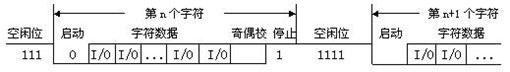{#fig-uartwork}

异步串行通信方式中一个重要的参数是波特率。在一般的“0”/“1”系统中，波特率即每秒钟传输的位数。UART通信中，发送端和接收端要使用相同的波特率来进行数据传输，这是因为波特率决定了数据的传输速率。如果发送端和接收端的波特率不一致，就会导致传输速率不匹配，造成数据传输错误和数据丢失的情况。同时还会出现传输不稳定的现象，例如接收端无法正确的解码发送端发送的信息，导致通信失败。国际上规定了一个标准波特率系列，它们是最常用的波特率。标准波特率系列为110、300、600、1200、1800、2400、4800、9600和19200。本设计中使用的波特率为115200.

### MQTT网络协议

MQTT（最初是MQ Telemetry Transport的缩写）是一种轻量级、发布-订阅的机器对机器消息队列/消息队列服务网络协议。MQTT的设计目标是保证可靠性、高效性和低延迟，并且能够在不稳定的网络环境下运行。MQTT协议基于TCP/IP协议栈，在网络模型中的位置如[@fig-mqttintcp]所示，支持QoS（服务质量）等级为0、1和2，具有较强的灵活性和可扩展性。它专为与资源受限或网络带宽有限的远程设备进行连接而设计，在物联网领域得到了广泛的应用，例如环境监测、智能家居、工业自动化等领域。

{#fig-mqttintcp}

#### 术语解释

首先对MQTT协议规范中的名词进行解释。

1. MQTT报文：MQTT报文是MQTT协议中用于进行通信的数据单元。MQTT报文采用二进制格式，由固定报头、可变报头和有效负载组成，用于在MQTT客户端之间传递消息和控制信息。客户端与物联网平台间的消息交换如[@fig-mqtt2iot]所示

{#fig-mqtt2iot}

2. 主题(Topic)：附加在应用消息上的一个标签，用于标识消息的主题或主题路径，它是一个由一个或多个层级组成的字符串。在MQTT中，发布者（Publisher）将消息发布到特定的topic上，而订阅者（Subscriber）则通过订阅特定的topic来接收感兴趣的消息。

3. 有效负载(payload)：消息传输时携带的实际数据。每个MQTT消息都可以包含一个有效负载，用于传递具体的信息，它的格式和含义完全由应用程序定义。MQTT本身并不对有效负载的内容进行解释或处理，而是将其作为不透明的数据进行传输。

#### 报头

固定报头的长度并非固定，其由两部分组成：第一部分长度为1字节，表示该MQTT报文的消息传输类型；该字节的高四位为消息类型，低四位为标志位，在不同的消息类型中具有不同的作用，例如在PUBLISH报文中低四位用于指定QoS等级等信息，在大多数情况下低四位无作用，全0即可。当前MQTT协议中共有16种消息传输类型，[@tbl-MQTTS]中列出了重要且常用的消息传输类型及它们的值。

|名字|值|报文流动方向|描述|
|---|---|---|---|
|CONNECT|1|客户端到服务端|客户端请求连接服务端|
|PUBLISH|3|两个方向都允许|发布消息|
|SUBSCRIBE|8|客户端到服务端|客户订阅请求|
|DISCONNECT|15|客户端到服务端|客户端断开连接|
: [常用MQTT报文的类型]{#tbl-MQTTS}

第二部分为剩余长度，表示当前报文剩余部分的字节数，包括可变报头和负载的数据，不包括剩余长度字段本身的字节数。也就是说，在数值上剩余长度 = 可变报头 + 有效载荷。
   
剩余长度采用一个变长的编码方案，对小于128的值其采用单字节编码，更大的值按照下述编码方式进行处理低7位有效位用于编码数据，最高有效位用于指示是否有更多的字节。因此每个字节可以编码128个数值和一个延续位(continuation bit)。剩余长度字段最大4个字节。例如，十进制数64会被编码为一个字节，数值是64，十六进制表示为0x40,。十进制数字321(=65+2*128)被编码为两个字节，最低有效位在前。第一个字节是6+128=193。注意最高位为1表示后面至少还有一个字节。第二个字节是2.

#### CONNECT连接报文

CONNECT报文是MQTT协议中用于建立与MQTT代理（Broker）之间连接的报文。它是MQTT客户端在初始阶段发送的第一个报文，用于建立会话并进行身份验证。

##### 固定报头

查询上表可以得到固定报头中MQTT报文类型为1，标志位全部设置为0，则可以得到固定报头的第一个字节为0x10. 剩余长度需要在得到可变报头及有效载荷后才能进行计算

##### 可变报头

CONNECT报文的可变报头按照下列次序包括四个字段：协议名(Protocol Name)，协议级别(Protocol Level)，连接标志(Connect Flags)和保持连接(Keep Alive)。其中协议名的数据固定，四字节表示的“MQTT”的ASCII编码。
   
协议级别（Protocol Level）指定了客户端使用的MQTT协议版本号，占据了2个字节（16位），是一个无符号整数。在连接建立之前，客户端和服务器之间必须协商一个协议级别。如果客户端和服务器支持的协议级别不同，则连接将被拒绝。协议级别指示客户端使用的MQTT协议版本。MQTT 3.1.1的协议级别是4（0x04），而MQTT 5.0的协议级别是5（0x05）。阿里云物联网平台产品文档中显示，目前物联网平台支持MQTT标准协议接入，兼容5.0、3.1.1和3.1版本协议。因此本设计中采用MQTT3.1.1协议，协议级别填写0x04
   
连接标志是MQTT连接报文中的可变报头字段之一，它用于定义MQTT客户端与MQTT代理服务器之间连接的一些行为特征和约束。连接标志是一个8位字节，其中的各个位定义了不同的连接选项。在MQTT 3.1.1规范中连接标志的8位所代表的连接选项如[@tbl-connect]所示。考虑到物联网平台在连接时需要提供用户名及密码，这一字节设置为0xC2.

| 位  | 名称            | 含义                    |内容|
| --- | --------------- | ----------------------- |---|
| 7    | Username Flag    | 用户名标志位              |1|
| 6    | Password Flag    | 密码标志位               |1|
| 5    | Will Retain      | 遗嘱消息保留标志位         |0|
| 4    | Will QoS         | 遗嘱消息服务质量等级标志位 |0|
| 3    | Will QoS       | 遗嘱消息服务质量等级标志位          |0|
| 2    | Will Flag    | 遗嘱消息标志位         |0|
| 1    | Clean Session    | 清理会话状态标志位        |1|
| 0    | Reserved         | 保留位                   |0|
: [连接标志位]{#tbl-connect}

保持连接时间(Keep Alive Time)是MQTT连接报文中的可变报头字段之一，用来指定客户端和服务器之间的心跳间隔时间，以确保连接的有效性。
   
在 MQTT 协议中，客户端和服务器之间需要维持一个 TCP 连接，但如果没有数据传输，这个连接可能会被某些路由器或防火墙主动断开，或者服务器因为客户端已经断开而释放连接资源。为了避免这种情况的发生，MQTT 协议使用心跳机制来保持连接的有效性。当客户端向服务器发送连接请求时，连接报文中会包含一个 Keep Alive 时间参数。服务器会在这个时间内定期向客户端发送心跳包，如果在 Keep Alive 时间内没有收到客户端的任何消息，服务器会认为客户端已经断开连接，主动关闭连接资源。
   
需要注意的是，客户端和服务器之间的心跳时间间隔不应该太长，否则可能会导致长时间没有数据传输，增加网络拥塞的可能性。同时，心跳时间间隔也不应该太短，否则会增加网络流量和服务器负载，影响系统的性能。根据物联网平台建议，这一字段被设置为300秒，转换成16进制为01 2C.

##### 有效载荷

在MQTT的CONNECT报文中，有效载荷（Payload）包含了与连接相关的各种参数和选项，用于传递客户端与代理之间的连接信息。这一部分需根据物联网平台的规范进行填写。

#### PUBLISH报文

MQTT的PUBLISH报文是用于发布消息的报文类型。它允许MQTT客户端将消息发送到指定的主题（topic），以便其他订阅了相应主题的客户端可以接收并处理这些消息。

##### 固定报头

PUBLISH报文的固定报头的格式如[@tbl-MQTTP]所示，其中第一字节的高四位为MQTT报文类型，在MQTT的PUBLISH报文中固定为3(0x30)

| 位数    | 7    | 6    | 5    | 4    | 3    | 2    | 1    | 0    |
| ------- | ---- | ---- | ---- | ---- | ---- | ---- | ---- | ---- |
| 第一个字节 | 0x30 |   |   |   | DUP  | QoS | QoS | RETAIN |
| 第二个字节 | 剩余长度 |
: [MQTT的PUBLISH报文固定报头]{#tbl-MQTTP}
   
其中DUP(Duplicate flag)为重发标志位，用于指示消息是否是重复发布。如果当前消息是之前已经发送过的消息的副本，则DUP标志位置为1，否则为0。QoS(Quality of Service)为服务质量等级，用于指示消息传输的可靠性。QoS等级有三种，分别是0、1、2。RETAIN(Retain)为保留标志位，用于指示服务器是否要保留当前消息，以供后续新的订阅者订阅。本系统中这些位均置为0。

##### 可变报头

可变报头按顺序包含主题名长度、主题名和报文标识符。第一个字节为可变报头长度，后面多个字节表示Topic；只有当QoS等级是1或2的时，报文标识符（Packet Identifier）字段才能出现在 PUBLISH 报文中，因此在本系统中PUBLISH的可变报头部分仅两部分。

##### 有效载荷

有效载荷包含将被发布的应用消息。数据的内容和格式是应用特定的。需要根据物联网平台的规范进行调整。本设计中物联网平台采用透传模式接收数据，因此将传感器采集到的数据格式不变放入有效载荷中即可。

#### 小结

通过上述对MQTT协议规范的说明可以看出，MQTT协议并不像TCP协议，对发送的所有数据进行校验，而是仅记录发送数据的长度。也就是说在发送数据长度固定后，根据MQTT协议规范，MQTT数据包的头部会被完全确定。考虑到单片机的计算性能较差，将MQTT协议的CONNECT报文所有数据以及PUBLISH报文的部分数据进行固化，不再逐字节推算MQTT数据包的内容。在本设计中，PUBLISH报文的有效载荷长度固定为7，这个长度适合将传感器数据完整的上传至物联网平台。

### AMQP

AMQP（Advanced Message Queuing Protocol）即高级消息队列协议。在配置AMQP服务端订阅后，物联网平台会将所有已订阅类型的消息，通过AMQP通道推送至服务器。AMQP服务端消息流转流程如[@fig-amqpwork]所示：

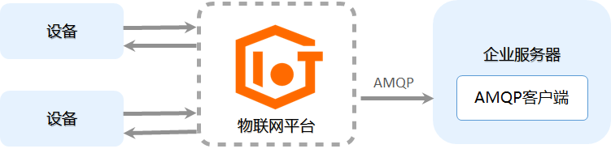{#fig-amqpwork}

AMQP服务端订阅的优势有：

1. 支持多消费组。在多消费同时订阅统一产品的情况下，不同消费组可同时收到来自同一产品的相同消息。

2. 方便排查问题。物联网平台支持实时查看客户端状态，查看堆积和消费速率。

3. 保证消息推送可靠性即时性。设备生成的消息可以直接推送给消费者。如果推送过程中出现限流或失败，这些消息将进入一个堆积队列。在堆积队列中，这些消息会采用降级模式进行处理，以确保不会影响实时推送的能力。即使消费者的客户端宕机或由于消费能力不足导致消息堆积，一旦消费端恢复正常，设备生成的消息可以和堆积的消息并行发送。这样可以确保设备生成的实时推送消息具有优先权，以使实时推送消息的状态得到优先恢复。

## 硬件

### IAP15W4K58S4单片机

IAP15W4K58S4隶属于STC研发的STC15W4K32S4系列单片机。它是STC生产的一种单时钟/机器周期（1T）的单片机，属于新一代8051单片机，具有宽电压范围、高可靠性、低功耗和超强抗干扰能力。

该单片机内部集成了高精度R/C时钟（精度为±0.3%），温度漂移范围为±1%（-40℃至+85℃），在常温下温度漂移为±0.6%（-20℃至+65℃）。它具备8路10位PWM输出，8路高速10位A/D转换（每秒30万次），内置4K字节的大容量SRAM，并且具有4组独立的高速异步串行通信端口（UART1/UART2/UART3/UART4），以及1组高速同步串行通信端口（SPI）。这些特性使得它非常适用于多串口通信、电机控制和在强干扰环境中的应用。

IAP15W4K58S4单片机具有低成本、高性能和良好的抗干扰性能，因此在本系统中被认为是微控制器的最佳选择。

### 128x64 OLED IIC显示屏

OLED显示屏采用自发光材料，无需背光板，具有广阔的视角范围、均匀的画质、快速的响应速度和易于彩色化等优势。其简单的驱动电路可实现高亮度、高分辨率、稳定的图像显示，符合轻薄短小的设计原则，适用于中小尺寸的显示面板。此外，OLED显示屏具有低驱动电压、低能耗的特点，可与太阳能电池、集成电路等兼容。由于OLED是全固态、非真空器件，具有抗震荡、耐低温(-40℃)等特性，适用于各种工作条件。

在本设计中，我们使用IIC协议对OLED显示屏进行控制，使其能够在现场显示数据。IIC是一种同步串行通信协议，也称为I2C（Inter-Integrated Circuit）。它采用两根线实现全双工通信，其中一根线为时钟线（SCL），另一根线为数据线（SDA）。通常情况下，IIC总线由一个主设备和一个或多个从设备组成。主设备产生时钟信号并负责发起所有的通信，从设备则被动接受并响应主设备的请求。IIC通信具有以下特点：

1. 速度较慢：IIC总线的最高速率一般为400kHz，速度比SPI和UART慢。

2. 线路简单：IIC总线只需要两根线，线路简单。

3. 可靠性高：IIC总线采用了多主从、冲突检测和应答机制，通信可靠性高。

4. 传输距离较短：IIC总线传输距离较短，一般不超过1米。

5. 集成度高：IIC总线在集成电路中得到广泛应用，如EEPROM、温度传感器、电子罗盘等。

在IIC通信中，主设备先发送起始信号（Start），然后发送从设备的地址和读写标志位，接着从设备发送应答信号（ACK），主设备确认后开始传输数据。数据传输完毕后，主设备发送停止信号（Stop）。

### ESP8266 

ESP8266为上海乐鑫公司开发的一款低成本，具有完整TCP/IP协议栈的WiFi芯片，它集成了处理器、Wi-Fi无线网络功能和外围设备接口，是一种强大而灵活的物联网（IoT）解决方案。

ESP8266模块采用了低功耗的32位Tensilica L106 Xtensa核心处理器，工作频率可达80 MHz。它内置了Wi-Fi功能，支持标准的802.11 b/g/n协议，并提供了丰富的网络连接功能，可以作为一个Wi-Fi客户端或作为一个独立的Wi-Fi接入点。

ESP8266在模块上的封装图[@Esp8266modulefamilyESP8266Support]如[@fig-esp12]所示

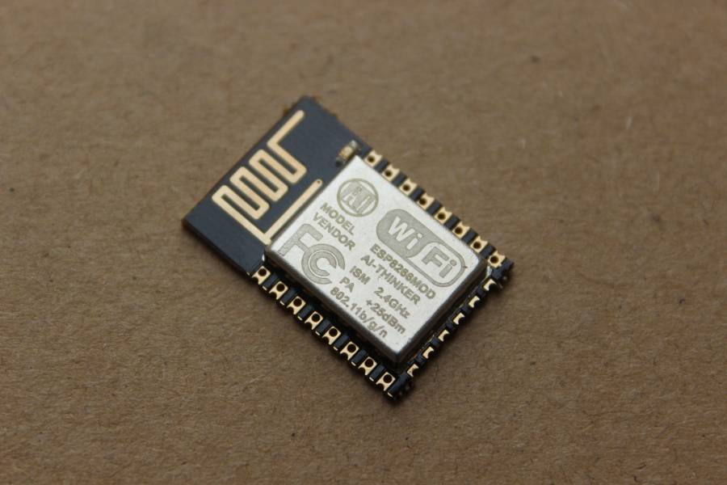{#fig-esp12}

## 小结

本部分中说明了本系统中使用的通信协议以及硬件工具，通过对UART通信协议原理的了解可以帮助我们在系统的软件开发时正确的与外围模块间进行消息传输；通过对MQTT协议的了解得到了可复用的MQTT的CONNECT报文以及MQTT的PUBLISH报文；通过对AMQP协议的了解可帮助我们可靠的获取设备上传的环境数据。硬件的选取则体现出该系统的低成本、耐用性强等优势。

# 概要设计

## 系统功能分析

从用户与开发者的角度看，该系统实现的功能如[@fig-systemcase]用例图所示。

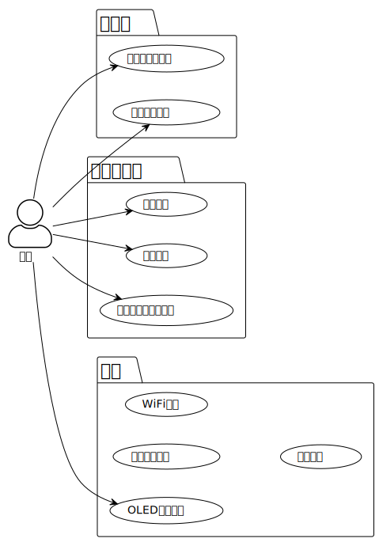{#fig-systemcase}

本系统对用户分为两类，一类是普通用户，一类是开发者用户。普通用户仅拥有对数据的查看权限，他们可以在物端利用OLED屏幕查看实时采集的数据，也可以利用浏览器从远端查看物端采集到的数据。开发者用户可以利用物联网平台上的功能，进行诸如设备管理、产品管理等专业功能，也可以直接访问服务器端控制层的接口，更加自由的访问数据。

实际上，对于服务器端控制层接口并未加密，该层对数据持久层做了包装，使得外部人员能够便捷的访问，更好的分析数据。

## 系统结构分析

本设计中，环境数据采集系统自数据采集端至数据展示端共三层，系统部署架构如[@fig-systemdeploy]所示。系统分为信息感知层、数据流转层和展示层。信息感知层与数据流转层之间依靠能够提供WiFi连接的路由器进行连接，数据流转层与展示层之间则通过物联网提供的数据流转功能，依靠实时消息流转AMQP进行信息传输。

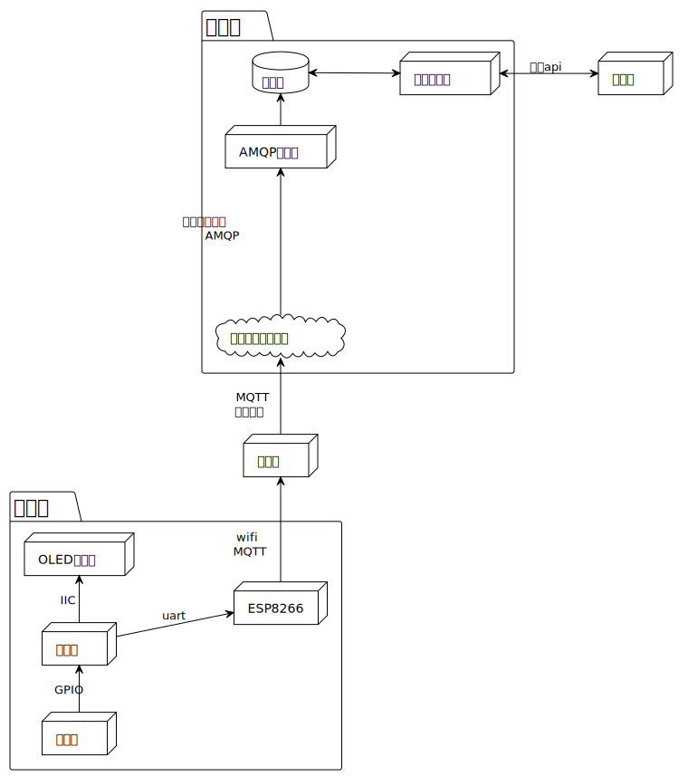{#fig-systemdeploy}

在信息感知层中以单片机为控制核心，其通过GPIO通用输入输出接口获取传感器信息，并通过IIC总线将数据发送至OLED显示屏进行展示；同时，利用UART通用异步手法器将数据发送至ESP8266模块。该模块通过WiFi与互联网连接，可以将数据上传至物联网平台。

展示层中与物联网平台进行交互的仅有AMQP客户端，该客户端能够接收物联网平台发送的信息，并将其进行解析后存储至数据库。业务服务器与数据库进行交互，对数据进行分析整理后可在浏览器前端中进行展示。

在本系统中，实现了信息感知层与数据展示层的分离，互不干扰运行状态。当单片机因宕机断开连接后，阿里云平台日志服务可以报错提醒；当展示层中AMQP客户端因故障无法接收消息时，云平台AMQP服务端订阅会将消息导入堆积队列堆积态消息采用降级模式，不会影响实时推送能力；即使消费者的客户端宕机，或因消费能力不足堆积了消息，消费端恢复后，设备生成的消息也可以和堆积消息并行发送，使设备优先恢复实时推送消息状态。

## 业务流程分析

### 信息采集

[@fig-stcdata]展示了信息感知层中传感器接收到环境信息后各个模块之间的协作关系。在该图中，实线实心箭头代表了需接收返回消息的同步消息，虚线线框箭头代表返回消息，实现线框箭头代表无需接收返回消息的异步消息。在采集环境数据之前，需要保证各模块已经初始化完毕，可以正常工作。[@fig-stcdata]展示的仅是无异常状态发生时的采集环境数据流程。当异常状态发生导致流程中断以至于单片机系统卡死时，由看门狗系统来使单片机系统自动重启，以保证对环境数据的采集能够连续自动化运行。

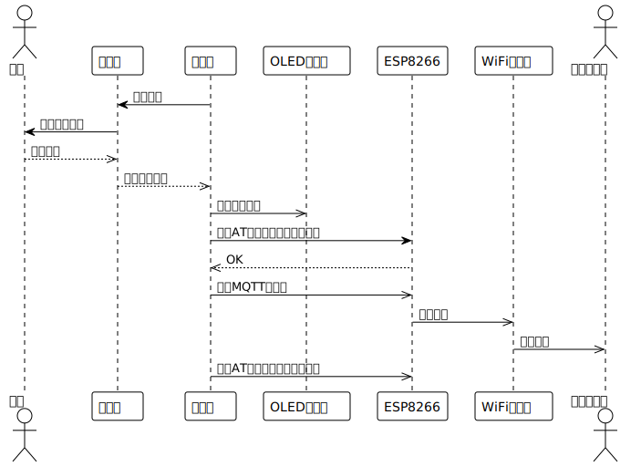{#fig-stcdata}

### 数据存储与展示

[@fig-datasave]展示了展示层中的工作流程。在展示层中，业务服务于数据的接收服务是隔离的，AMQP客户端独立于业务服务之外，仅负责接收数据并将数据存至服务器。这种设计可以保证数据的接收速率，防止因业务服务处理缓慢导致消息发生阻塞，以至于无法保证消息的实时性。

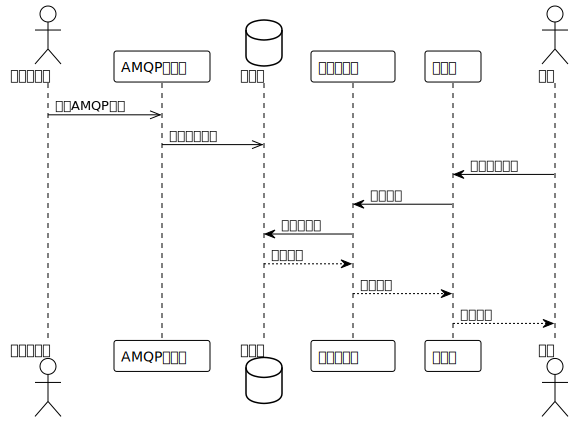{#fig-datasave}

## 开发运行环境

### 开发环境

本系统单片机程序在Keil C51平台进行开发。Keil C51是由德国知名软件公司Keil（现已并入ARM公司）开发的微控制器软件开发平台，专门用于基于8051内核的微控制器应用开发。作为一款优秀的开发工具，它集成了编辑、编译和仿真等功能，并支持PLM、汇编语言和C语言的程序设计。

软件烧录之前需要在在电脑系统中安装STC-USB驱动，以便电脑系统可以正确的读取单片机串口，能够通过串口将数据下载至单片机中。烧录工具则选择宏晶科技开发的STC-ISP软件。

数据展示层的AMQP客户端软件与业务服务器后端的代码由Java开发。使用IntelliJ IDEA编写开发相应的程序代码。IntelliJ IDEA是一款领先的Java和Kotlin开发集成开发环境（IDE）。它提供了一系列功能，旨在提高开发效率。这些功能包括智能编码辅助、可靠的重构工具、实时代码导航、内置的开发者工具以及对Web和企业开发的全面支持。

对设备上传消息的存储由MySQL数据库完成。MySQL是一种开源的关系型数据库管理系统，被广泛应用于Web和企业级应用。它具备可靠性、高性能、可扩展性和安全性等优势。MySQL优化查询、提供缓存和索引等功能，支持主从复制和集群技术。它适用于不同编程语言和操作系统，并享有庞大的开源社区支持。

### 运行环境

单片机程序运行于IAP15W4K58S4单片机，配备相应的ESP8266模块以提供WiFi连接。由于在单片机软件的开发中使用了特定的寄存器地址以及寄存器中的存储格式，因此并不能跨平台（如ARM，x86平台等）使用。由于对ESP8266的初始化及在使用过程中使用了特定的控制命令，因此不保证更换其他型号的WiFi通信模块后程序能够正常运行。

由于Java通过使用Java虚拟机（JVM）作为中间层，将Java代码编译为字节码。这意味着Java程序可以在任何支持Java虚拟机的平台上运行，无需针对特定平台进行重新编译。AMQP客户端软件以及业务服务软件在打包后可运行与任意的，安装有Java 17版本及以上版本环境的系统中。

MySQL可以部署于包括Windows、Linux、Mac等多种平台，且由于MySQL是基于标准的关系型数据库管理系统，它的代码和数据格式是独立于特定平台的，这意味着可以轻松地将MySQL数据库从一个平台迁移到另一个平台，而无需进行大规模的修改或重新编写。本系统中仅需保证数据库为MySQL数据库，并提供相应的连接地址、用户名和密码即可，对运行平台无要求。

## 小结

本章中提出了远程数据采集系统的功能分析，系统概要设计以及开发运行环境。完成了对系统搭建的初步分析。在功能分析中抽取出用户可见的功能以及保证系统正常持续运行的功能；在概要设计中对整个系统进行分层设计，便于分模块进行开发；完成了对开发运行环境的选取，保障了系统的正常运行。

# 系统设计

系统设计分为两部分；一部分为单片机中相关模块的实现，该部分代码的开发由C语言完成，该部分实现了数据感知层中单片机对外围各硬件模块的控制；一部分为业务服务器中相关模块的实现，包括AMQP客户端的开发、实体类及数据库设计、数据保持层开发、外部网络接口设计这四部分。

## 单片机相关模块

### 串口通信

单片机以串口通信的方式控制ESP8266模块，通过WiFi连接来上传相应的MQTT数据报。同时在开发的过程中，可以通过串口通信的方式将单片机中的数据发送至上位机（PC端）来进行代码的调试。因此串口通信模块是该系统的信息感知层中必不可少的功能之一。串口通信模块所需要实现的功能如[@fig-uartcase]所示。

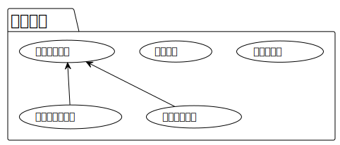{#fig-uartcase}

IAP15W4K58S4单片机提供了四组完全独立的高速异步串行通信串口，分时切换可当9组串口使用，串口名及端口如[@tbl-uartGPIO]所示：

|串口名|端口|可切换端口1|可切换端口2|
|---|---|---|---|
|UART1|RxD/P3.0, TxD/P3.1|RxD_2/P3.6, TxD_2/P3.7|RxD_3/P1.6, TxD_3/P1.7|
|UART2|RxD2/P1.0, TxD2/P1.1|RxD2_2/P4.6, TxD2_2/P4.7|-|
|UART3|RxD3/P0.0, TxD3/P0.1|RxD3_2/P5.0, TxD3_2/P5.1|-|
|UART4|RxD4/P0.2, TxD4/P0.3|RxD4_2/P5.2, TxD4_2/P5.3|-|
: [单片机串口名及端口]{#tbl-uartGPIO}

#### 串口初始化

在开发的过程中使用了两个串口通信模块，这两个串口通信模块是有可能同时进行工作的，例如在与上位机（PC）进行通信的时候ESP8266向单片机发送了数据。因此我们需要使用两个不同的计时器对串口通信模块进行初始化设置。在本系统中，使用了定时器2（T2）对UART1进行初始化，使用定时器4（T4）对UART1进行初始化。初始化流程如[@fig-uartinit]所示：

{#fig-uartinit}

这里以与ESP8266连接的UART4串口的初始化为例，说明对UART串口的初始化过程：

1. 在设置引脚功能处，设置P_SW2寄存器的S4_S0位，用于选择UART4的引脚功能。在这里，将其设置为1，以选择引脚P5.2作为UART4的接收线（RxD4_2）和引脚P5.3作为UART4的发送线（TxD4_2）；

2. 配置UART控制寄存器，设置chuankou4控制寄存器（S4CON寄存器）的内容来控制串口4的通信格式，以使其支持8位可变波特率模式；

3. 开始配置串口4所需要的定时器4。根据所需的波特率（BAUD）和系统主频（MAIN_Fosc）计算并设置定时器4的低8位与高8位重装值，低8位重装值的计算公式如[@eq-t4low]所示，高8位重装值的计算公式如[@eq-t4high]所示；

$$
T4L = (65536 - \left(\frac{{\text{{MAIN\_Fosc}}}}{{4 \times \text{{BAUD}}}}\right))
$$ {#eq-t4low}

$$ 
T4H = (65536 - \left(\frac{{\text{{MAIN\_Fosc}}}}{{4 \times \text{{BAUD}}}}\right)) >> 8 
$$ {#eq-t4high}

$$ T4H = (65536 - \left(\frac{{\text{{MAIN\_Fosc}}}}{{4 \times \text{{BAUD}}}}\right)) >> 8 $$

4. 设置定时器工作模式。对UART串口所需定时器进行初始化时使用1T模式，1T模式表示每个时钟周期为一个机器周期，这意味着定时器4的计数器将以系统主频的速度递增；

5. 启动定时器4的计时；

6. 使能UART4中断，具体来说是使能UART4的接收中断；

7. 开启总中断允许位，允许中断请求；

以上配置中包括引脚选择、波特率设置、定时器配置和中断使能。通过这些配置，UART4就准备好在后续的操作。

#### 串口发送字符串数据

本系统中使用串口发送的数据为字符串数据，包括AT命令以及MQTT通信报文。发送字符串数据的前提为UART串口能够发送字符数据。[@fig-uartsendchar]展示了串口发送字符数据的流程：

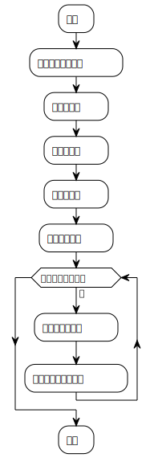{#fig-uartsendchar}

在完成对串口发送字符数据的开发后，对串口发送字符串数据的开发则变为调用串口发送字符数据函数，具体实现流程图如[@fig-uartsendstring]所示：

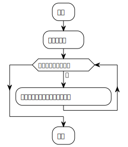{#fig-uartsendstring}

### ESP8266控制模块

[@fig-espcase]展示了ESP8266模块需要完成的功能。

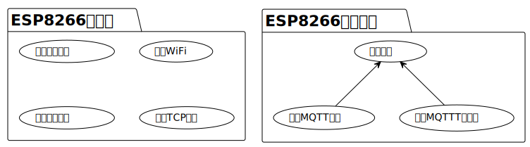{#fig-espcase}

对ESP8266的控制分为两部分，一部分为对ESP8266的初始化，包括对其工作模式及连接的WiFi进行控制；一部分为通过ESP8266发送数据，因为ESP8266仅负责连接WiFi并发送MQTT数据报，因此将使用MQTT数据报上传传感器数据部分整合入ESP8266控制模块的发送数据功能中。相应的初始化以及使用流程如[@fig-espinit]所示

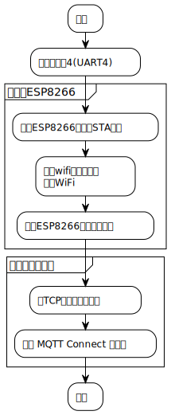{#fig-espinit}

ESP8266模块通过UART4串口与单片机连接，因此完成对ESP8266控制模块开发的前提是完成对UART4串口的初始化，保证UART4串口能够正常的发送数据。

AT命令（AT commands）是一种通用的控制指令集，用于与调制解调器、移动设备、无线模块等通信设备进行通信，其作用是控制和配置通信设备的行为，以实现各种功能，例如设置通信参数、发送短信、拨打电话、连接网络等。不同的设备和模块支持的AT命令可能会有所差异，但它们遵循基本的语法和命令结构。一般而言，AT命令由以下几个部分组成：

1. 命令前缀：通常是AT+，用于指示后面是一个AT命令。
2. 命令名称：表示要执行的具体命令，例如AT+CGSN用于获取设备的IMEI号码。
3. 参数：用于指定命令的具体配置或操作，例如AT+CPIN="1234"用于设置SIM卡的PIN码为"1234"。
4. 结束符：通常是回车符（\r）或回车换行符（\r\n），用于标识命令的结束。

本系统中，单片机通过发送AT命令字符串来对ESP8266模块进行控制。

#### 设置工作模式

ESP8266有三种工作模式，分别为Station模式、Access Point模式和SoftAP模式，三种模式的说明如下：

1. Station模式：这是ESP8266最常用的工作模式。在Station模式下，ESP8266可以就像普通的WiFi客户端一样，连接到一个已有的WiFi网络。通过这种方式，ESP8266可以与互联网连接，发送和接收数据。在Station工作模式下，ESP8266可以作为一个TCP或UDP客户端或服务器来进行通信，具体使用何种传输层协议进行网络通信需要其他的AT命令来进行设置。

2. Access Point模式，亦被称作AP模式：在AP模式下，ESP8266可以作为一个WiFi热点运行，其他设备可以通过该热点连接到ESP8266.

3. SoftAP模式：SoftAP模式是一种特殊的AP模式，它可以让ESP8266同时作为WiFi热点和客户端。这种模式通常用于无线网桥，让一个无线网络连接到另一个无线网络。

本系统中，ESP8266仅需要连接相应的WiFi，实现通过WiFi发送数据的功能即可，因此将其工作模式设定为Station模式，具体使用的AT命令如下所示：

```c
AT+CWMODE=1

```

#### 连接WiFi

AT+CWJAP命令是ESP8266芯片支持的一个AT指令，用于在Station模式下连接到一个Wi-Fi网络。该命令的具体格式为：

```c
AT+CWJAP="<ssid>","<password>"

```

其中，\<ssid>是要连接的Wi-Fi网络的SSID（即网络名称），\<password>是该网络的密码。执行该命令后，ESP8266将会尝试连接到指定的Wi-Fi网络。如果连接成功，ESP8266将会返回一个OK响应，否则将返回ERROR响应。

在执行AT+CWJAP命令前，需使用AT+CWMODE命令将ESP8266设置为Station模式。如果Wi-Fi网络需要通过DHCP获取IP地址，ESP8266会在成功连接到网络后自动获取IP地址。如果网络不支持DHCP，则需要使用AT+CIPSTA命令手动配置IP地址。

#### 设置ESP8266连接模式

AT+CIPMUX是ESP8266芯片支持的一个AT指令，用于设置ESP8266的连接模式。该命令的具体格式为：

```c
AT+CIPMUX=<mode>

```

其中，\<mode>表示要设置的连接模式，可以是以下两种之一：

0：单链接模式
   
1：多链接模式
   
在单连接模式下，ESP8266只能同时建立一条TCP或UDP连接。如果尝试建立连接时存在已经建立的连接，ESP8266会关闭之前的连接，并建立新的连接。在多连接模式下，ESP8266可以同时建立最多5条TCP或UDP连接。每个连接都由一个独立的连接ID标识，可以通过AT+CIPSTART命令启动连接，通过AT+CIPCLOSE命令关闭连接。
   
在执行AT +CIPMUX命令后，ESP8266将会进入指定的连接模式。本系统中每个环境数据感知端都配置了一个ESP8266芯片用于数据传输，且数据传输的速率不高，因此ESP8266工作于单链接模式下即可。需要注意的是，在执行AT+CIPMUX命令时，如果ESP8266当前已经处于一个连接模式下，最好先使用AT+CIPCLOSE命令关闭所有连接，才能生效新的连接模式设置。

#### 连接服务器

AT+CIPSTART是ESP8266芯片支持的一个AT指令，用于建立TCP或UDP连接。该命令的具体格式为：

```c
AT+CIPSTART=<type>,<addr>,<port>[,<tcp_keepalive>]

```
其中，\<type>表示连接类型，可以是以下两种之一：
   
"TCP"：表示TCP连接
   
"UDP"：表示UDP连接
   
\<addr>表示目标IP地址或域名，可以是IPv4地址或域名。
   
\<port>表示目标端口号，可以是1~65535之间的整数。
   
\<tcp_keepalive>表示TCP连接的心跳保持时间，单位为秒，可选。如果不指定该参数，默认为0，表示不启用TCP心跳保持功能。
   
在执行AT+CIPSTART命令后，ESP8266将会尝试建立指定类型的连接。如果连接成功，ESP8266会返回CONNECTED，表示连接已建立，可以进行数据传输。如果连接失败，ESP8266会返回ERROR，表示连接建立失败。
   
因为在本系统中ESP8266工作与单链接模式下，所以不需要再去介绍多链接模式下的AT+CIPSTART命令的格式。
   
阿里云物联网给出的设备连接地址如下所示：

```c
<Product_Key> .iot-as-mqtt.ap-northeast-1.aliyuncs.com<br>
   
```

其中，\<Product_Key>由阿里云物联网平台的控制台给出，对其进行Ping操作即可获取相应的IP地址为47.91.8.141。结合物联网平台文档中给出的MQTT连接端口号，可得到AT+CIPSTART命令的具体代码为:

```c
AT+CIPSTART=”TCP”,”47.91.8.141,”1883”

```

#### 发送数据

AT+CIPSEND是ESP8266芯片支持的一个AT指令，用于向已建立的TCP或UDP连接发送数据。该指令的基本格式为：
   
```c
AT+CIPSEND=<length>

```
   
其中\<length>表示待发送数据的长度，单位为字节。在执行AT+CIPSEND命令后，ESP8266会在返回“>”后进入数据发送模式。此时所有后续输入的数据都会被直接发送到已建立的连接中。发送完成后ESP8266模块会返回“SEND OK”或“SEND FAIL”等响应。
   
需要注意的是，当用户在输入数据时，ESP8266 模块会一直等待，直到输入的数据长度达到指定的\<length>，或者超时（默认为 5 秒）。如果用户输入的数据长度不足\<length>，ESP8266 模块会一直等待，直到超时，然后自动将数据发送出去。因此，在每次发送数据后可以先等待5s再去识别ESP8266的返回值，以便数据完全发送。

在本系统中，将MQTT的CONNECT报文所有字节以及MQTT的PUBLISH报文的部分字节固化到代码中，节省了生成MQTT报文的时间以及占用的单片机计算资源。

### 看门狗

看门狗（Watchdog）是一种硬件或软件定时器，用于监视系统或程序是否正常运行。它的作用类似于一个“看门人”，当系统或程序出现异常情况时，看门狗会强制重启系统或程序，以恢复系统或程序的正常运行。

在嵌入式系统中，看门狗通常由硬件电路实现。它的工作原理类似于定时器，定时器会定期产生一个中断信号，而看门狗则是定期产生一个脉冲信号，如果系统正常运行，会在一定时间内对该脉冲进行响应，从而防止系统崩溃。

本系统设计中使用IAP15W4K58S4单片机中自带的硬件看门狗功能，该功能使用特殊功能寄存器WDT_CONTR来控制硬件看门狗，WDT_CONTR寄存器的详细参数如[@tbl-sfr1]所示，该寄存器每个位的含义如[@tbl-sfr2]所示：

|寄存器名 SFR name|地址 Address|长度 Length|
|---|---|---|
|WDT_CONTR|0C1H|8 bit|
: [寄存器参数]{#tbl-sfr1}

|bit|name|含义|
|---|---|---|
|B7|WDT_FLAG|看门狗溢出标志位，当溢出时，该位由硬件置1，可用软件将其清零。|
|B6|-|-|
|B5|EN_WDT|看门狗允许位，当设置为1时，看门狗启动。|
|B4|CLR_WDT|看门狗清零位,当设为1时,看门狗将重新计数。硬件将自动清0此位。|
|B3|IDLE_WDT|看门狗“IDLE ”模式位, 当设置为“1”时, 看门狗定时器在“空闲模式”计数 当清“0”该位时, 看门狗定时器在“空闲模式”时不计数。|
|B2~B0|PS2,PS1,PS0|看门狗定时器预分频值|
: [WDT_CONTR寄存器内容]{#tbl-sfr2}

通过WDT_CONTR寄存器的PS2-PS0位来设置的值被称为看门狗的分频值，不同的分频值会影响到看门狗的定时时间，也就是最大的喂狗时间间隔。看门狗溢出时间可以根据分频值（Pre-scale）和时钟频率（scillator frequency）得到，具体的计算公式如[@eq-time]所示：

$$\text{{看门狗溢出时间}} = \frac{{12 \times \text{{Pre-scale}} \times 32768}}{{\text{{Oscillator frequency}}}}$${#eq-time}

$$\text{{看门狗溢出时间}} = \frac{{12 \times \text{{Pre-scale}} \times 32768}}{{\text{{Oscillator frequency}}}}$$ 

在本系统中，看门狗的初始化与喂狗可由下述代码完成

```c
WDT_CONTR = 0X37;

```

## 业务服务

业务服务代码的类图如[@fig-spring]所示，业务服务分为三层加一个模块，三层分别为含有实体类的实体层；利用自定义SQL语句以及JPA提供的接口对数据库进行CRUD操作的Repo层；为浏览器提供网络接口的控制层以及一个获取物联网平台消息的AMQP客户端。在业务服务代码之外配套有一个MySQL数据库，用啦存储消息数据。

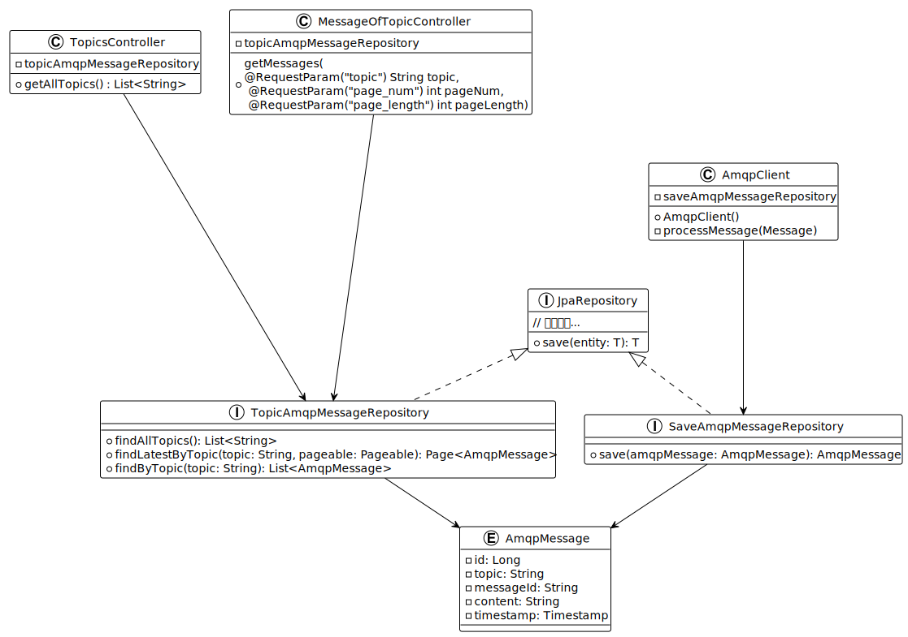{#fig-spring}

### 实体层与数据库设计

通过对amqp客户端接收到的消息进行解析，可以得到消息中的数据共有三种属性，考虑到主键及时间戳，数据库中相关表的结构如[@tbl-enti]所示：

|列名|含义|数据库中数据类型|实体类中数据类型|
|---|---|---|---|
|id|主键|big int|Long int|
|topic|MQTT消息主题|var char|String|
|content|MQTT消息内容|var|char|String|
|timestamp|时间戳|timestamp|Timestamp|
: [实体类及数据表]{#tbl-enti}

id字段为该表的主键，其值为非空且被设置为自增类型，这样在表新增数据的同时不需要手动的赋值，数据库会自动的为id字段生成唯一的值，其相关代码如下所示：

```java
@Id
@GeneratedValue(strategy = GenerationType.IDENTITY)
@Column(name = "id")
private Long id;

```

在上述示例代码中，使用\@Id注解来指定id属性为该实体类的主键；使用\@Column(name = “id”)注解来指明该属性对应于数据库相应表中的id列；使用\@GeneratedValue注解来指定主键的生成策略为GenerationType.IDENTITY，表示使用的是自增长主键，于此同时，也需要在数据库中对字段id进行设置，以使得该字段具有自增的能力。在创建表的时候，可以使用如下的SQL语句对字段id进行设置：

```java
CREATE TABLE amqpmessage (
  id BIGINT UNSIGNED NOT NULL AUTO_INCREMENT PRIMARY KEY
);

```

注意，使用自增主键时，插入记录的时候不能指定主键值，否则如果程序指定的主键在数据表中存在，则会发生主键冲突，导致插入操作失败。

为存储设备消息的到达时间，以便于按照消息的新旧来展示可视化的展示环境数据，在MySQL中，存储时间主要有两种数据类型，分别为datatime类型与timestamp类型，二者的对比如[@tbl-time]所示：

|日期类型|占用空间|日期格式|日期范围|是否存在时区问题|
|---|---|---|---|---|
|DATATIME|8字节|YYYY-MM-DD HH:MM:SS|1000-01-01 00:00:00 ～ 9999-12-31 23:59:59|是|
|TIMESTAMP|4字节|YYYY-MM-DD HH:MM:SS|1970-01-01 00:00:00 ～ 2038-01-19 03:14:07|否|
: [时间类型对比]{#tbl-time}

考虑到空间效率以及方便后续对数据库中的记录进行处理[@schwartzHighPerformanceMySQL2012]本系统中采用timestamp类型来存放设备消息到达服务器所对应的时间。在实体类中相应的代码如下所示：

```java
import java.sql.Timestamp;
……
@Column(name = "timestamp", columnDefinition = "TIMESTAMP DEFAULT CURRENT_TIMESTAMP")
private Timestamp timestamp;

```

在上述代码中，使用了\@Column(columnDefinition = "TIMESTAMP DEFAULT CURRENT_TIMESTAMP")注解来定义该实体类中的timestamp字段，DEFAULT CURRENT_TIMESTAMP表示该字段在插入数据时默认使用当前时间戳。因此在向表中插入新数据时，不必手动输入该字段的值，MySQL会自动以系统当前时间计算，自动的为该字段赋予当前时间戳。

在对环境数据的可视化时，需要对表中的数据按照设备名（即topic的值）进行分类输出，随着系统的运行，设备的数量会上升，topic的数量也会随之上升，必定会对表的操作产生性能上的影响。尽管为每个设备接收到的数据都创建一张新表是一个较为简单直观的想法，但在操作上来讲不仅需要数据库动态的产生新表，也需要服务器程序动态的生成实体类，这不仅带来开发上的困难，同时也会在性能和可维护性上出现问题。

针对不断的添加和报废设备这个需求，本系统给出的解决方案是使用一张表来存储信息，而不是为每个设备都创建单独的表，理由如下：

1.	高效性：使用单独的表来存储所有设备的信息，可以更高效的查询和管理数据，因为只需要在一张表中搜索数据而无需调用多张表。

2.	可扩展性：如果添加新设备或报废了旧设备，那么无需创建或删除表，只需添加或删除行数据。

3.	维护性：维护单张表比维护多张表容易的多。例如，程序只需要维护单个表的索引而不是多个表的索引。

因此，本系统采用单张表存储所有amqp队列发送的信息，并为topic列建立索引，以提高对该列的查询性能。对topic列建立的索引内容如[@tbl-topic]所示：


|索引名|字段|索引类型|索引方法|
|---|---|---|---|
|index_topic|topic|NORMAL|BTREE|
: [Topic列索引参数]{#tbl-topic}

可以在Navicat中图形化的建立索引。对于Spring Boot来说，索引是透明的。不需要再代码中做任何特殊的处理或配置，当使用JPA等ORM框架进行数据库的访问时，MySQL自动管理索引并使用它们来加速查询，只需要在数据库层面创建好索引即可。

### Repo层及对数据表的访问

在本系统中，对表的操作分为两类，一类是实现起来较为简单的消息记录的添加，一类是利用自定义SQL语句对表中数据进行检索。

在Spring框架下对表的基本操作流程如[@fig-dao]所示：

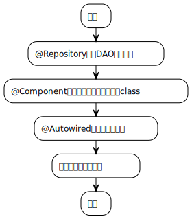{#fig-dao}

\@Repository是Spring框架提供的注解之一，它用于标记数据访问层（DAO）的实现类，告诉Spring该类是一个Spring Bean，并将其纳入到Spring IoC容器中。一般情况下，我们在DAO层的实现类上使用\@Repository注解来标记该类，这样Spring就可以自动地将其注入到需要使用该类的其他类中。

下面的示例代码展示了一个DAO层实现类，该类实现了实体类AmqpMessage对应的数据表的存储操作：

```java
\@Repository
public interface SaveAmqpMessageRepository extends JpaRepository<AmqpMessage,Long> {
  AmqpMessage save(AmqpMessage amqpMessage);
}

```

这段代码定义了一个接口 它继承了Spring Data JPA库中的JpaRepository接口。这意味着该接口具有许多 CRUD操作方法，例如保存、查找、删除等等。在这个接口中，定义了一个名为save的方法，该方法接受一个类型为AmqpMessage的参数，并返回一个AmqpMessage类型的对象。此方法将被用于将AmqpMessage对象保存到数据库中。

实际上，由于SaveAmqpMessageRepository继承了 JpaRepository 接口，Spring Data JPA将为我们提供默认实现的save方法，不需要我们自己编写该方法的具体实现。但是在这里我们显式地声明了一个同名的save方法，这是为了在开发时更清楚地知道在使用哪个方法来保存实体对象。这个自定义的save方法会覆盖JpaRepository中默认的save方法，所以当我们在使用SaveAmqpMessageRepository接口时，Spring Data JPA将使用这个自定义的save方法来执行保存操作。

注意到上述代码中只定义了相应的接口，实际使用时需要将接口实例化后才能使用。Spring提供了\@Autowired注解用于自动装配Bean，但不可以在一个没有被声明为Spring Bean的类内部使用\@Autowired注解，因为 Spring容器没有对该类进行管理。此时需要使用\@Component注解对类进行标识，\@Component是一种泛化的注解，可标注任何类为Spring组件。被标注为\@Component的类会被Spring扫描，并且在启动应用程序时实例化。实际上，\@Service、\@Controller、\@Repository等注解也是由\@Component派生而来的，所以它们也可以用于将类标记为Spring组件，以便于将其纳入Spring容器中进行管理。以下代码展示了如何在自己创建的类中利用该上述接口来存储实体类至数据库：

```java
@Component
public class AmqpClient {
	@Autowired
  SaveAmqpMessageRepository saveAmqpMessageRepository;
……
private void save(){
  AmqpMessage amqpMessage = new AmqpMessage();
  ……
  saveAmqpMessageRepository.save(amqpMessage);
  }
}

```

对表的自定义索引操作与上述向表中添加数据的操作相似，不同之处在于创建DAO层的实现类时，利用\@Query注解将自定义的 SQL查询语句绑定到 Spring Data JPA 的 repository 方法上，从而实现对数据的查询、更新、删除等操作。本设计中需要的查询操作有获取消息表中的所有topic，获取某一topic内的所有消息，以及按分页的方式获取某一topic内的消息。使用自定义SQL查询语句的示例代码如下所示，该示例中展示了按分页的方式获取某一topic内的消息这一SQL语句以及将其与自定义的方法绑定：

```java
@Repository
public interface TopicAmqpMessageRepository extends JpaRepository<AmqpMessage, Long> {
  @Query("select am from AmqpMessage am where am.topic = :topic ORDER BY am.id desc ")
  Page<AmqpMessage> findLatestByTopic(@Param("topic") String topic, Pageable pageable);
}

```

### 控制层与前端页面

本系统中控制层提供了两个接口，控制层中的类为[@fig-spring]中最高处的两个尾名为Controller的类。这两个类提供的接口的规范如[@tbl-mapper]所示

|请求地址|请求方法|请求内容|返回内容|m
|---|---|---|---|
|服务器地址:端口号/message|GET|topic,page_num,pagelength|topic对应的消息，以列表形式返回|
|服务器地址:端口号/topics|GET|无|所有topic|
: [前端请求规范]{#tbl-mapper}

浏览器前端运行时的时序图如[@fig-jstime]所示：

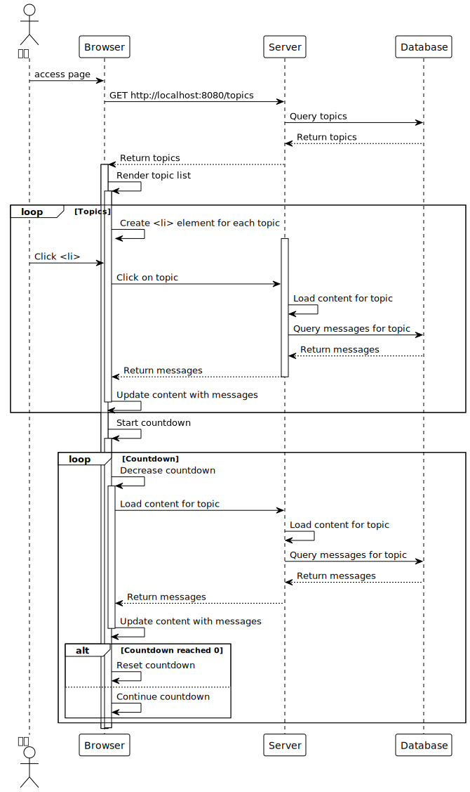{#fig-jstime}

前端界面在启动时，首先向后端发送请求，以获取所有的topic并展示于页面之中。当用户点击某一topic时，页面上会显示出该topic下设备上传的数据内容。

在前端的页面内添加了一个定时触发器，该触发器计时的值由用户输入。触发器的作用为定时刷新用户正在浏览的topic的内容，以确保用户浏览信息的即时性。

# 系统测试

## 所需工具

系统测试需要的工具和前期准备有：

1. 单片机开发板及无线通信模块，这两个硬件设备为环境数据感知层中必不可少的设备。传感器则使用单片机开发版上的按钮代替。开发板与ESP8266连接完毕后的实物图如[@fig-shiwutu]所示：

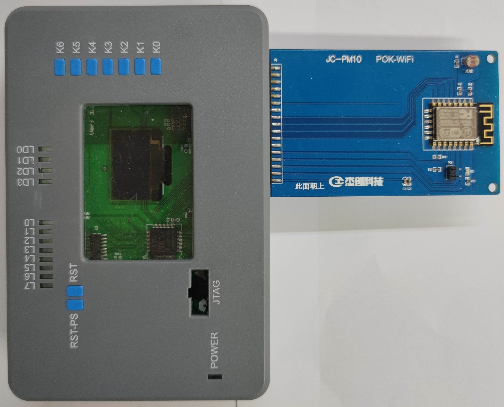{#fig-shiwutu}

2. WiFi名称及密码，这一组数据供单片机驱动ESP8266连接网络之用。

3. 阿里云物联网平台开通实例，注册产品和设备。物联网平台是本系统中必不可少的数据中间平台，承载了接收数据、流转数据的任务。因此需要拥有可用的物联网平台账户，保证设备可以正常连接至平台。

4. Navicat或其他数据库查看软件。可以直观的观察到新的数据被添加如数据库中。

5. Idea或其他Java开发平台。尽管依靠Spring框架搭建的服务端软件能够向日志文件中输出日志以供查阅，但是并不支持实时的查阅日志。Idea或其他Java开发平台的控制台能够实时的输出日志，便于查看服务端接收到了物联网平台发送的消息。

## 测试内容

本系统的测试分阶段，分层进行，各项测试通过后即可保证系统正常运行。测试的项目如下：

1. 单片机正常启动、联网、OLED显示数据、向物联网发送数据测试；

2. 在网络波动情况下单片机重启测试；

3. 物联网平台消息流转、服务端正常接收、存储数据测试；

4. 前端数据显示测试。

## 测试结果

打开手机WiFi热点或使用路由器创建WiFi，将WiFi名及密码写入至单片机程序，编译后获取相应的二进制文件。ESP8266模块插入单片机开发板中，将二进制文件烧录至单片机。

单片机插电，打开路由器管理后台或手机热点管理界面，可以看到有相应的ESP8266模块接入，即证明单片机正常启动，ESP8266模块正常联网，相应的结果如[@fig-shiwutuwifi]所示；

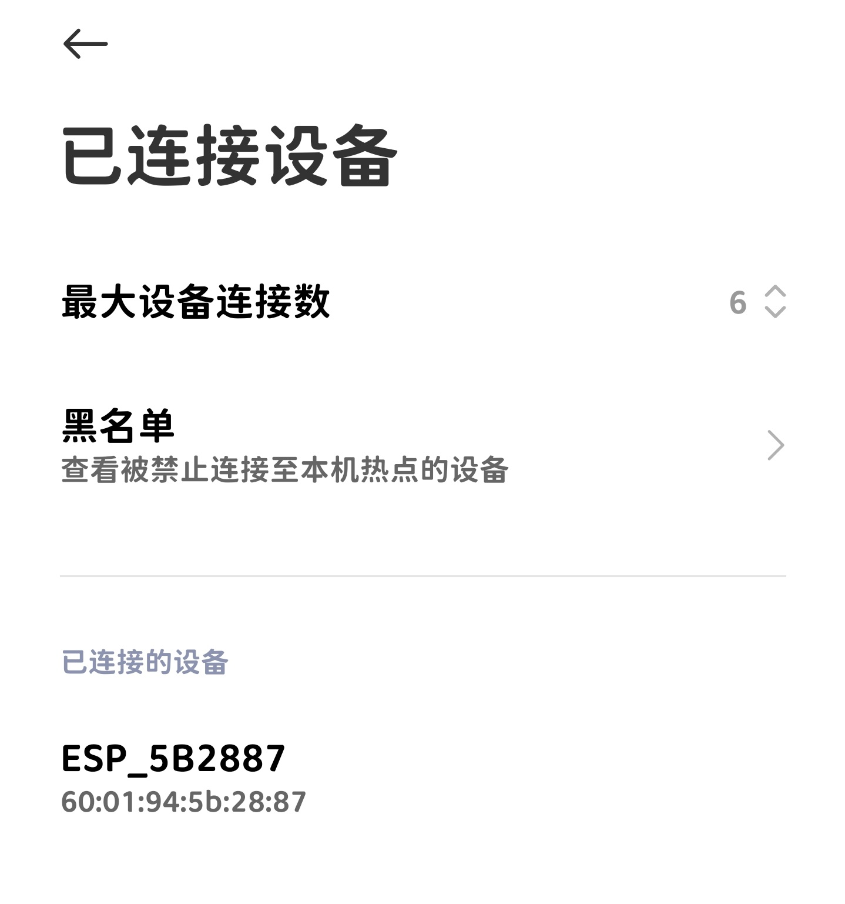{#fig-shiwutuwifi}

本系统中使用单片机的按钮作为传感器，按压单片机按钮，OLED显示屏上亮起按钮所对应的数字，即可证明OLED显示屏显示数据正常工作，相应结果如[@fig-shiwutuoled]所示；为保证能够正常的显示单片机按钮的按压情况，对OLED显示屏上显示的数字做了延时处理。

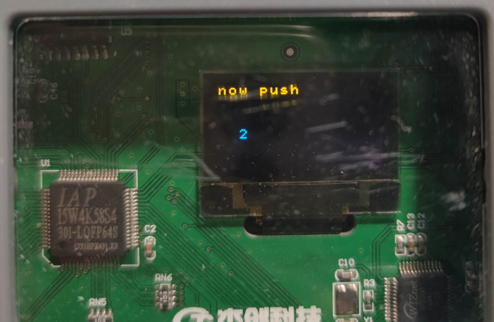{#fig-shiwutuoled}

上一步测试取得预期结果后，打开物联网控制台界面，查看日志，看到设备上线记录以及MQTT消息上传记录，即可证明单片机正常接入了物联网平台，可以向物联网平台发送数据，相关结果如[@fig-shiwutuiot]所示。

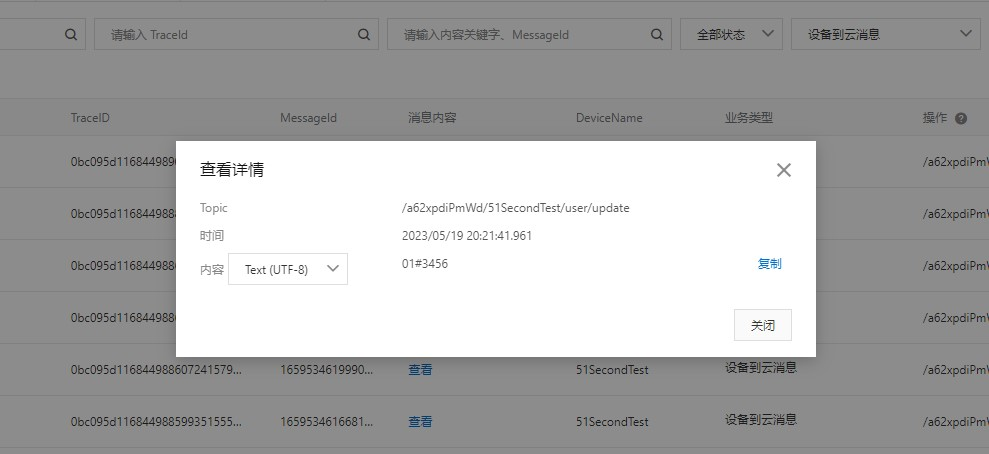{#fig-shiwutuiot}

启动服务程序，可在控制台上看到日志输出，日志中输出物联网平台消息队列中堆积的消息；打开数据库查看软件（如 Navicat），按时间查看后在数据表中能找到新添加了相应的记录，即证明物联网平台消息流转正常，服务端能正常接收、存储数据，Sping后端日志如[@fig-shiwutuspringlog]所示，数据库中数据如[@fig-shiwutumysql]所示。

{#fig-shiwutuspringlog}

{#fig-shiwutumysql}

使用浏览器访问相应的网络页面，可以查询到新接收到的数据，即证明前端数据显示正常，相应结果如[@fig-shiwutuexplore]所示。

{#fig-shiwutuexplore}

在单片机长时间工作，大量发送数据后，使用数据库图形化查看软件查看数据表中的内容如[@fig-longtimems]所示，可查阅到自单片机启动后发送的大量数据；使用浏览器访问相应的展示层网页页面，点击相关Topic后可以看到单片机发送的所有消息，相应页面如[@fig-longtimepage]所示，证明该系统支持长时间的采集环境数据。

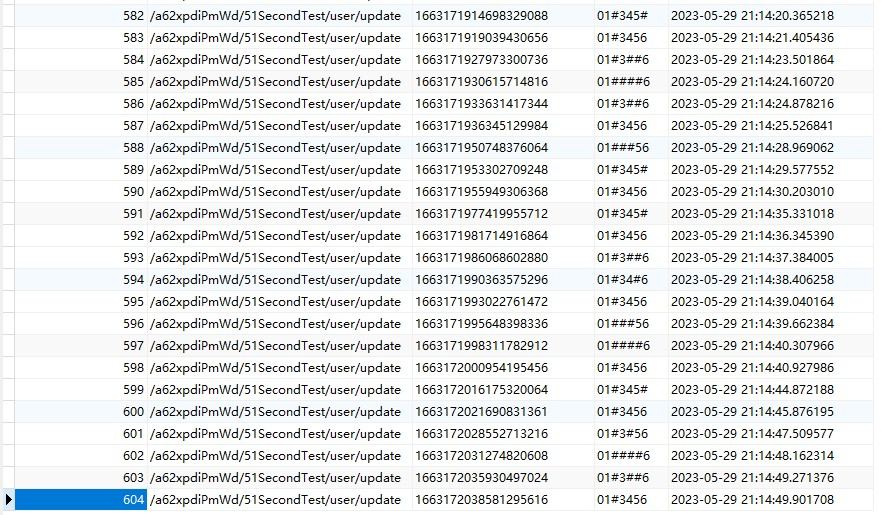{#fig-longtimems}

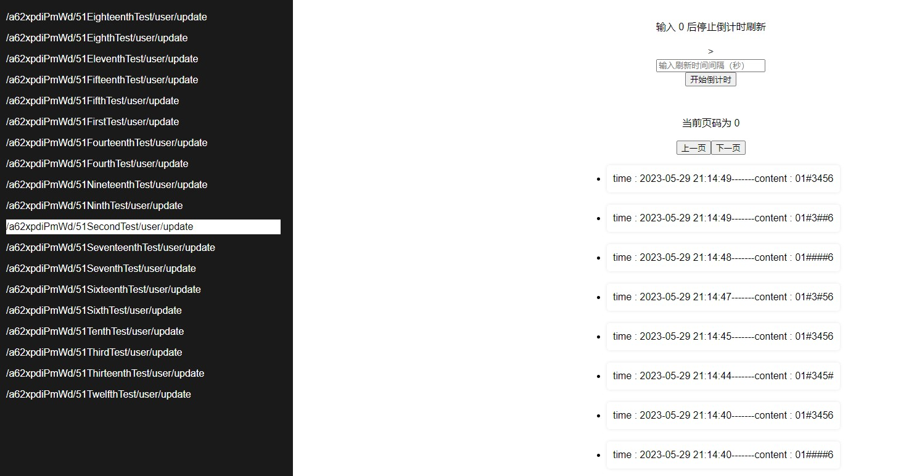{#fig-longtimepage}

断开WiFi连接可以看到单片机重启，即证明网络波动情况下单片机可自动重启，直至网络恢复正常。

# 致谢

首先，感谢闫江毓老师在这次毕业设计中对我耐心而专业的指导和帮助。老师不仅提供给我各种硬件资源帮助我顺利完成设计，而且针对我在设计之中的不足之处提供了很多宝贵的建议；正因为老师在专业知识方面的耐心而细致的指导，我才能顺利完成本次系统设计和论文的撰写。

其次，感谢大学四年来传授我专业知识的各位老师，这些专业的知识是我能够完成本次设计的基础。感谢我周围的同窗舍友，他们的各种奇妙的解决问题思路让我受益匪浅。

# 参考文献

:::{#refs}
:::